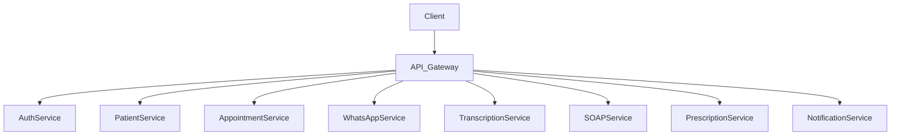

# Swaraksha - AI Healthcare Documentation Assistant

> Multilingual voice-first digital assistant for small Indian clinics - automating clinical documentation with AWS AI services

**Swaraksha** (स्वरक्षा) - meaning "voice protection" in Sanskrit - safeguards patient care through intelligent voice documentation.

This project provides a robust, microservices-based backend system for Clinic AI. It is designed as a monorepo consisting of serverless AWS Lambda microservices, shared logic, and frontends.

## Overview

An AI-powered system that transforms doctor-patient consultations into structured clinical documentation, generates prescriptions, and delivers patient-friendly summaries via WhatsApp—all in Hindi, English, or code-switched conversations.

## Key Microservices
* **Auth Service**: User authentication and authorization.
* **Patient Service**: Patient profile and details management.
* **Appointment Service**: Scheduling and managing appointments.
* **WhatsApp Service**: Integration with the WhatsApp API for notifications and interactions.
* **Transcription Service**: AI transcription of medical audio/video using external models.
* **SOAP Service**: Generating SOAP notes from transcriptions and consultations.
* **Prescription Service**: Managing prescriptions given to patients.
* **Notification Service**: Handling push/email/SMS notifications.

## Architecture



```text
Consultation → Transcribe → Bedrock (SOAP) → Comprehend Medical → Translate → WhatsApp
                    ↓              ↓                  ↓               ↓
                  Aurora      Step Functions      S3 Storage      SNS/API
```

## Tech Stack

- **Compute**: AWS Lambda (Node.js 18.x)
- **Database**: Amazon Aurora Serverless v2 PostgreSQL, DynamoDB
- **AI/ML**: Amazon Transcribe, Bedrock (Claude 3), Comprehend Medical, Translate
- **Orchestration**: AWS Step Functions
- **Messaging**: WhatsApp Business API via Amazon SNS
- **Auth**: Amazon Cognito
- **Infrastructure**: AWS SAM, AWS CDK (TypeScript)

## How to Run Locally

1. Navigate to the `infrastructure` folder.
2. Ensure you have the [AWS SAM CLI](https://docs.aws.amazon.com/serverless-application-model/latest/developerguide/install-sam-cli.html) installed.
3. Start the local API Gateway:
   ```bash
   sam local start-api
   ```
4. Each service's lambdas can be invoked locally via SAM.

## Deployment Steps

1. Make sure you are authenticated with AWS CLI.
2. Use AWS SAM to build and deploy:
   ```bash
   sam build
   sam deploy --guided
   ```

## Demo Mode

Includes synthetic patient data with realistic Hindi-English code-switching consultations for safe demonstration without real patient information.

## Use Case

Designed for small Indian clinics processing 40-60 patients/day, reducing documentation time from 5-10 minutes to under 90 seconds per consultation.

## Cost

Estimated $106-192/month for typical clinic usage (60 consultations/day).

## Compliance

- Data encryption at rest (AES-256) and in transit (TLS 1.3)
- Automatic audio deletion after 24 hours
- Role-based access control (Doctor, Receptionist, Administrator)
- Comprehensive audit logging

## License

MIT

## About Swaraksha

**Swaraksha** combines "Swara" (स्वर - voice) and "Raksha" (रक्षा - protection), embodying our mission to protect and preserve patient care through intelligent voice documentation. The system ensures accurate clinical records while respecting patient privacy and supporting India's linguistic diversity.

## Hackathon Submission

Built for **AI for Bharat Hackathon** - demonstrating AI-powered healthcare automation for resource-constrained clinics in India.
