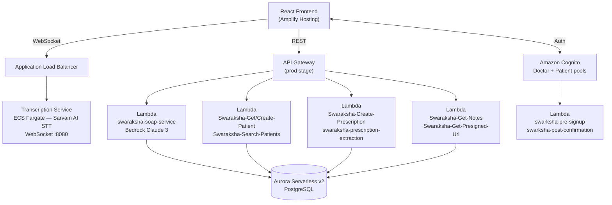

# Swaraksha — AI Healthcare Documentation Assistant

> Multilingual voice-first clinical assistant for small Indian clinics, automating documentation end-to-end with AWS AI services.

**Swaraksha** (स्वरक्षा) combines "Swara" (स्वर — voice) and "Raksha" (रक्षा — protection).  
It captures doctor-patient consultations in real time, generates structured SOAP notes via Amazon Bedrock, and surfaces everything through a React web frontend — all supporting Hindi, English, and code-switched conversation.

Built for the **AI for Bharat Hackathon**.

---

## What It Does

| Step | What happens |
|---|---|
| 1. Record | Doctor opens the web app and starts a consultation session |
| 2. Transcribe | Real-time audio is streamed to the ECS transcription service (Sarvam AI STT) over WebSocket |
| 3. SOAP generation | Transcript is sent to a Lambda that calls **Amazon Bedrock (Claude 3)** and returns a structured SOAP note |
| 4. Prescription | A separate Lambda extracts and stores prescription data |
| 5. Review & Finalise | Doctor reviews the auto-generated note in the UI, edits if needed, and finalises |
| 6. Patient access | Patient can log in with a separate Cognito pool and view their transcriptions and summaries |

Reduces per-consultation documentation time from **5-10 minutes to under 90 seconds** for a typical clinic of 40-60 patients per day.

---

## Repository Structure

```
swaraksha/
├── frontend/               # React + TypeScript frontend (Vite)
│   ├── src/
│   │   ├── components/     # Page-level UI components
│   │   ├── contexts/       # ConsultationContext, UserContext, DoctorProfileContext
│   │   ├── hooks/          # useRealtimeSTT — WebSocket STT hook
│   │   ├── aws-exports.ts  # Cognito + API Gateway endpoint config
│   │   └── amplifyConfig.ts
│   └── amplify/            # AWS Amplify hosting config
├── services/
│   ├── auth-service/       # Lambda — pre-signup & post-confirmation Cognito triggers
│   ├── soap-service/       # Lambda — SOAP note generation via Bedrock (Claude 3)
│   ├── prescription-service/ # Lambda — prescription extraction
│   ├── transcription-service/ # ECS Fargate — real-time STT WebSocket server
│   ├── patient-service/    # Lambda — patient CRUD
│   ├── appointment-service/
│   ├── notification-service/
│   └── whatsapp-service/
├── infrastructure/         # AWS SAM template + CDK constructs
├── shared/                 # Shared utilities / models
├── docs/
│   ├── api-contracts.md          # API endpoint reference
│   └── aws-deployment-inventory.md  # Snapshot of deployed AWS resources
├── design.md               # Architecture and design decisions
└── requirements.md         # Product requirements
```

---

## Architecture


```mermaid
flowchart TD
    Browser["React Frontend\n(Amplify Hosting)"]
    APIGW["API Gateway\n(prod stage)"]
    Cognito["Amazon Cognito\nDoctor + Patient pools"]
    STT["Transcription Service\nECS Fargate — Sarvam AI STT\nWebSocket :8080"]
    ALB["Application Load Balancer"]
    SOAP["Lambda\nswaraksha-soap-service\nBedrock Claude 3"]
    Patient["Lambda\nSwaraksha-Get/Create-Patient\nSwaraksha-Search-Patients"]
    Prescription["Lambda\nSwaraksha-Create-Prescription\nswaraksha-prescription-extraction"]
    Notes["Lambda\nSwaraksha-Get-Notes\nSwaraksha-Get-Presigned-Url"]
    AuthTriggers["Lambda\nswarksha-pre-signup\nswarksha-post-confirmation"]
    DB[(Aurora Serverless v2\nPostgreSQL)]

    Browser -->|"REST"| APIGW
    Browser -->|"WebSocket"| ALB --> STT
    Browser <-->|"Auth"| Cognito
    Cognito --> AuthTriggers
    APIGW --> SOAP
    APIGW --> Patient
    APIGW --> Prescription
    APIGW --> Notes
    SOAP --> DB
    Patient --> DB
    Prescription --> DB
    Notes --> DB
```

---

## Tech Stack

| Layer | Technology |
|---|---|
| Frontend | React 18, TypeScript, Vite, AWS Amplify Hosting |
| Auth | Amazon Cognito (Doctor pool + Patient pool) |
| API | Amazon API Gateway REST (`https://i6a1l4o09d.execute-api.ap-south-1.amazonaws.com/prod`) |
| Lambda runtime | Node.js 20.x (most functions), Node.js 18.x (soap-service, ai-auth), Python 3.12 (auth triggers) |
| SOAP / AI | Amazon Bedrock — Claude 3 |
| Transcription | ECS Fargate — Sarvam AI STT (real-time WebSocket, port 8080) |
| Container registry | Amazon ECR (`swaraksha/transcription-service`) |
| Database | Amazon Aurora Serverless v2 (PostgreSQL) |
| Infrastructure as Code | AWS SAM (`infrastructure/template.yaml`) |
| Hosting | AWS Amplify (app ID `dgcluntl7g0fl`, region `ap-south-1`) |

---

## Deployed AWS Resources (ap-south-1)

See [`docs/aws-deployment-inventory.md`](docs/aws-deployment-inventory.md) for a full snapshot.

**Lambda functions**
- `swaraksha-soap-service` — SOAP note generation (Bedrock Claude 3)
- `swaraksha-prescription-extraction` — prescription parsing
- `Swaraksha-Create-Prescription`, `Swaraksha-Create-Patient`, `Swaraksha-Get-Patient`, `Swaraksha-Search-Patients`, `Swaraksha-Get-Notes`, `Swaraksha-Get-Presigned-Url`
- `swarksha-pre-signup`, `swarksha-post-confirmation` — Cognito triggers
- `swaraksha-ai-auth` — custom auth handler

**ECS**
- Cluster `swaraksha-cluster` → Service `transcription-service` (Fargate, 1 task, port 8080)

**Cognito**
- `SwarakshaDoctorUserPool` (`ap-south-1_byWYZ74sf`) — doctor accounts
- `swaraksha-user-pool` (`ap-south-1_ZOAs8JsXJ`) — patient accounts

---

## Running the Frontend Locally

```bash
cd frontend
npm install
npm run dev
```

The frontend talks to the live API Gateway and Cognito pools defined in `frontend/src/aws-exports.ts`.  
No local backend setup is required for demo purposes.

---

## Running Backend Services Locally

```bash
cd infrastructure
# Requires AWS SAM CLI — https://docs.aws.amazon.com/serverless-application-model/latest/developerguide/install-sam-cli.html
sam build
sam local start-api
```

Each Lambda under `services/` can also be invoked individually:

```bash
sam local invoke <FunctionName> --event events/sample.json
```

---

## Deploying to AWS

```bash
cd infrastructure
aws configure   # or use a named profile
sam build
sam deploy --guided
```

The transcription service has its own Docker-based deployment — see `services/transcription-service/Dockerfile` and push to ECR before deploying the ECS service.

---

## Compliance & Security

- Data encrypted at rest (AES-256) and in transit (TLS 1.3)
- Audio recordings deleted automatically after 24 hours
- Role-based access — Doctor and Patient have separate Cognito pools and UI layouts
- No secrets committed to the repository (credentials, `.env` files, and API tokens are git-ignored)

---

## License

MIT
