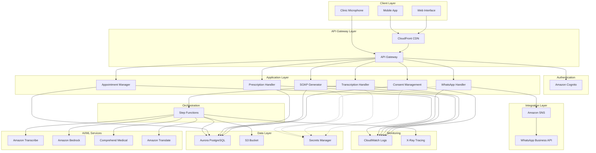
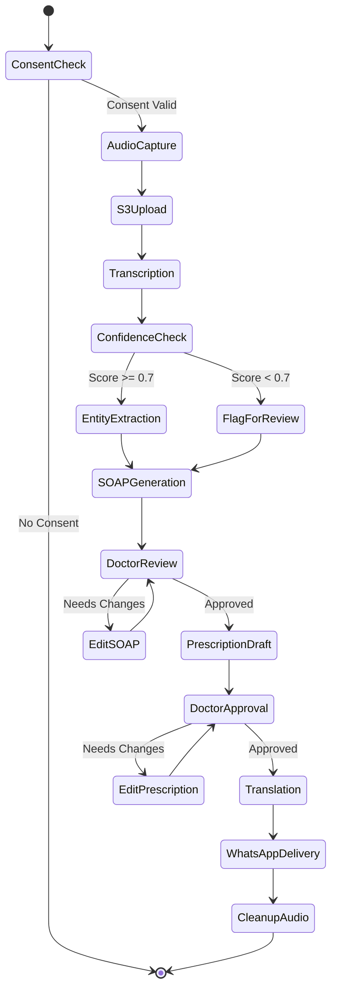

# Design Document: Swaraksha - AI Healthcare Documentation Assistant

## Overview

**Swaraksha** (स्वरक्षा - "voice protection") is a serverless, event-driven system built on AWS that automates clinical documentation for small Indian clinics. The system processes multilingual voice consultations (Hindi/English with code-switching), generates structured SOAP notes, creates prescription drafts, and delivers patient-friendly summaries via WhatsApp.

### Core Design Principles

1. **Serverless-First**: Leverage AWS Lambda and managed services to minimize operational overhead
2. **Event-Driven Architecture**: Use AWS Step Functions to orchestrate complex workflows
3. **Privacy by Design**: Encrypt all data, implement automatic retention policies, and require explicit consent
4. **Human-in-the-Loop**: All clinical decisions require doctor approval before finalization
5. **Multilingual Support**: Native support for Hindi, English, and code-switching scenarios
6. **Scalability**: Auto-scaling to handle 40-60 patients/day with room for growth
7. **Cost Optimization**: Use serverless and pay-per-use services suitable for small clinics

### Technology Stack

- **Compute**: AWS Lambda (Node.js 18.x runtime)
- **API Layer**: Amazon API Gateway (REST APIs)
- **Orchestration**: AWS Step Functions (Standard Workflows)
- **Database**: Amazon Aurora Serverless v2 PostgreSQL
- **Storage**: Amazon S3 (temporary audio storage)
- **Speech-to-Text**: Amazon Transcribe (streaming and batch)
- **Translation**: Amazon Translate
- **LLM**: Amazon Bedrock (Claude 3 Sonnet)
- **Medical NLP**: Amazon Comprehend Medical
- **Messaging**: Amazon SNS + WhatsApp Business API
- **Authentication**: Amazon Cognito User Pools
- **Secrets**: AWS Secrets Manager
- **Monitoring**: Amazon CloudWatch + X-Ray
- **CDN**: Amazon CloudFront (for web/mobile UI)


## Architecture

### High-Level Architecture




### Consultation Processing Workflow




### Component Responsibilities

#### 1. Consent Management Service
- **Purpose**: Manage patient consent records and authorization
- **Technology**: Lambda + Aurora PostgreSQL
- **Key Functions**:
  - Create consent records with digital signatures
  - Query consent status before processing
  - Support consent withdrawal and data deletion
  - Generate consent forms in multiple languages

#### 2. Transcription Service
- **Purpose**: Convert audio consultations to text transcripts
- **Technology**: Lambda + Amazon Transcribe + S3
- **Key Functions**:
  - Accept streaming or batch audio input
  - Support Hindi, English, and code-switching
  - Generate confidence scores per segment
  - Flag low-confidence segments for review
  - Store raw audio temporarily in S3

#### 3. SOAP Note Generator
- **Purpose**: Generate structured clinical documentation
- **Technology**: Lambda + Amazon Bedrock + Comprehend Medical
- **Key Functions**:
  - Parse transcripts into SOAP format (Subjective, Objective, Assessment, Plan)
  - Extract medical entities (symptoms, diagnoses, medications, procedures)
  - Calculate confidence scores for extracted entities
  - Flag sections requiring doctor review
  - Store SOAP notes in Aurora

#### 4. Prescription Handler
- **Purpose**: Generate and manage prescription drafts
- **Technology**: Lambda + Aurora PostgreSQL
- **Key Functions**:
  - Extract medication information from SOAP notes
  - Format prescriptions per Indian medical standards
  - Require explicit doctor approval
  - Generate printable PDF prescriptions
  - Support doctor-specific templates

#### 5. Translation Service
- **Purpose**: Translate medical content for patient communication
- **Technology**: Lambda + Amazon Translate
- **Key Functions**:
  - Translate SOAP notes to patient-friendly language
  - Support Hindi and English translations
  - Simplify medical terminology
  - Calculate translation quality scores
  - Flag low-quality translations for review

#### 6. WhatsApp Messaging Service
- **Purpose**: Deliver patient communications via WhatsApp
- **Technology**: Lambda + SNS + WhatsApp Business API
- **Key Functions**:
  - Send appointment confirmations
  - Deliver diagnosis summaries and medication instructions
  - Send follow-up reminders
  - Track delivery status and retry failures
  - Log patient responses

#### 7. Appointment Manager
- **Purpose**: Schedule and manage patient appointments
- **Technology**: Lambda + Aurora PostgreSQL
- **Key Functions**:
  - Create appointment records
  - Schedule follow-up reminders
  - Send automated reminders 24 hours before appointments
  - Process patient confirmation responses
  - Notify receptionists of reschedule requests

#### 8. Workflow Orchestrator
- **Purpose**: Coordinate multi-step consultation processing
- **Technology**: AWS Step Functions
- **Key Functions**:
  - Orchestrate transcription → entity extraction → SOAP generation → translation → messaging
  - Handle error states and retries
  - Implement human-in-the-loop approval gates
  - Track workflow execution state
  - Trigger cleanup tasks (audio deletion after 24 hours)


## Data Models

### Database Schema

```sql
-- Patients Table
CREATE TABLE patients (
    patient_id UUID PRIMARY KEY DEFAULT gen_random_uuid(),
    phone_number VARCHAR(15) UNIQUE NOT NULL,
    preferred_language VARCHAR(10) NOT NULL CHECK (preferred_language IN ('hi', 'en')),
    created_at TIMESTAMP WITH TIME ZONE DEFAULT CURRENT_TIMESTAMP,
    updated_at TIMESTAMP WITH TIME ZONE DEFAULT CURRENT_TIMESTAMP
);

-- Consent Records Table
CREATE TABLE consent_records (
    consent_id UUID PRIMARY KEY DEFAULT gen_random_uuid(),
    patient_id UUID NOT NULL REFERENCES patients(patient_id) ON DELETE CASCADE,
    consent_version VARCHAR(20) NOT NULL,
    consent_text TEXT NOT NULL,
    acceptance_method VARCHAR(50) NOT NULL CHECK (acceptance_method IN ('digital_signature', 'checkbox', 'verbal')),
    accepted_at TIMESTAMP WITH TIME ZONE NOT NULL,
    withdrawn_at TIMESTAMP WITH TIME ZONE,
    is_active BOOLEAN DEFAULT TRUE,
    created_at TIMESTAMP WITH TIME ZONE DEFAULT CURRENT_TIMESTAMP,
    CONSTRAINT one_active_consent_per_patient UNIQUE (patient_id, is_active) WHERE is_active = TRUE
);

-- Consultations Table
CREATE TABLE consultations (
    consultation_id UUID PRIMARY KEY DEFAULT gen_random_uuid(),
    patient_id UUID NOT NULL REFERENCES patients(patient_id) ON DELETE CASCADE,
    doctor_id UUID NOT NULL REFERENCES users(user_id),
    audio_s3_key VARCHAR(500),
    audio_duration_seconds INTEGER,
    consultation_date TIMESTAMP WITH TIME ZONE NOT NULL,
    status VARCHAR(50) NOT NULL CHECK (status IN ('recording', 'transcribing', 'generating_soap', 'pending_review', 'approved', 'completed', 'failed')),
    created_at TIMESTAMP WITH TIME ZONE DEFAULT CURRENT_TIMESTAMP,
    updated_at TIMESTAMP WITH TIME ZONE DEFAULT CURRENT_TIMESTAMP
);

-- Transcripts Table
CREATE TABLE transcripts (
    transcript_id UUID PRIMARY KEY DEFAULT gen_random_uuid(),
    consultation_id UUID NOT NULL REFERENCES consultations(consultation_id) ON DELETE CASCADE,
    transcript_text TEXT NOT NULL,
    language_detected VARCHAR(10),
    overall_confidence_score DECIMAL(3,2),
    flagged_for_review BOOLEAN DEFAULT FALSE,
    created_at TIMESTAMP WITH TIME ZONE DEFAULT CURRENT_TIMESTAMP
);

-- Transcript Segments Table (for confidence tracking)
CREATE TABLE transcript_segments (
    segment_id UUID PRIMARY KEY DEFAULT gen_random_uuid(),
    transcript_id UUID NOT NULL REFERENCES transcripts(transcript_id) ON DELETE CASCADE,
    segment_text TEXT NOT NULL,
    confidence_score DECIMAL(3,2) NOT NULL,
    start_time_seconds DECIMAL(10,2),
    end_time_seconds DECIMAL(10,2),
    flagged BOOLEAN DEFAULT FALSE
);

-- SOAP Notes Table
CREATE TABLE soap_notes (
    soap_note_id UUID PRIMARY KEY DEFAULT gen_random_uuid(),
    consultation_id UUID NOT NULL REFERENCES consultations(consultation_id) ON DELETE CASCADE,
    subjective TEXT,
    objective TEXT,
    assessment TEXT,
    plan TEXT,
    overall_confidence_score DECIMAL(3,2),
    flagged_sections JSONB,
    approved_by UUID REFERENCES users(user_id),
    approved_at TIMESTAMP WITH TIME ZONE,
    is_finalized BOOLEAN DEFAULT FALSE,
    created_at TIMESTAMP WITH TIME ZONE DEFAULT CURRENT_TIMESTAMP,
    updated_at TIMESTAMP WITH TIME ZONE DEFAULT CURRENT_TIMESTAMP
);

-- Medical Entities Table
CREATE TABLE medical_entities (
    entity_id UUID PRIMARY KEY DEFAULT gen_random_uuid(),
    soap_note_id UUID NOT NULL REFERENCES soap_notes(soap_note_id) ON DELETE CASCADE,
    entity_type VARCHAR(50) NOT NULL CHECK (entity_type IN ('symptom', 'diagnosis', 'medication', 'procedure', 'test')),
    entity_text TEXT NOT NULL,
    confidence_score DECIMAL(3,2) NOT NULL,
    flagged BOOLEAN DEFAULT FALSE,
    section VARCHAR(20) CHECK (section IN ('subjective', 'objective', 'assessment', 'plan'))
);

-- Prescriptions Table
CREATE TABLE prescriptions (
    prescription_id UUID PRIMARY KEY DEFAULT gen_random_uuid(),
    consultation_id UUID NOT NULL REFERENCES consultations(consultation_id) ON DELETE CASCADE,
    soap_note_id UUID NOT NULL REFERENCES soap_notes(soap_note_id),
    prescription_data JSONB NOT NULL,
    approved_by UUID REFERENCES users(user_id),
    approved_at TIMESTAMP WITH TIME ZONE,
    is_finalized BOOLEAN DEFAULT FALSE,
    pdf_s3_key VARCHAR(500),
    created_at TIMESTAMP WITH TIME ZONE DEFAULT CURRENT_TIMESTAMP,
    updated_at TIMESTAMP WITH TIME ZONE DEFAULT CURRENT_TIMESTAMP
);

-- Prescription Items Table
CREATE TABLE prescription_items (
    item_id UUID PRIMARY KEY DEFAULT gen_random_uuid(),
    prescription_id UUID NOT NULL REFERENCES prescriptions(prescription_id) ON DELETE CASCADE,
    medication_name VARCHAR(200) NOT NULL,
    dosage VARCHAR(100) NOT NULL,
    frequency VARCHAR(100) NOT NULL,
    duration VARCHAR(100) NOT NULL,
    special_instructions TEXT,
    confidence_score DECIMAL(3,2) NOT NULL
);

-- Appointments Table
CREATE TABLE appointments (
    appointment_id UUID PRIMARY KEY DEFAULT gen_random_uuid(),
    patient_id UUID NOT NULL REFERENCES patients(patient_id) ON DELETE CASCADE,
    consultation_id UUID REFERENCES consultations(consultation_id),
    appointment_date TIMESTAMP WITH TIME ZONE NOT NULL,
    appointment_type VARCHAR(50) CHECK (appointment_type IN ('initial', 'follow_up')),
    status VARCHAR(50) NOT NULL CHECK (status IN ('scheduled', 'confirmed', 'completed', 'cancelled', 'rescheduled')),
    reminder_sent_at TIMESTAMP WITH TIME ZONE,
    confirmed_at TIMESTAMP WITH TIME ZONE,
    created_at TIMESTAMP WITH TIME ZONE DEFAULT CURRENT_TIMESTAMP,
    updated_at TIMESTAMP WITH TIME ZONE DEFAULT CURRENT_TIMESTAMP
);

-- WhatsApp Messages Table
CREATE TABLE whatsapp_messages (
    message_id UUID PRIMARY KEY DEFAULT gen_random_uuid(),
    patient_id UUID NOT NULL REFERENCES patients(patient_id) ON DELETE CASCADE,
    consultation_id UUID REFERENCES consultations(consultation_id),
    appointment_id UUID REFERENCES appointments(appointment_id),
    message_type VARCHAR(50) CHECK (message_type IN ('diagnosis_summary', 'prescription', 'appointment_confirmation', 'follow_up_reminder')),
    message_text TEXT NOT NULL,
    language VARCHAR(10) NOT NULL,
    translation_quality_score DECIMAL(3,2),
    delivery_status VARCHAR(50) CHECK (delivery_status IN ('pending', 'sent', 'delivered', 'read', 'failed')),
    retry_count INTEGER DEFAULT 0,
    sent_at TIMESTAMP WITH TIME ZONE,
    delivered_at TIMESTAMP WITH TIME ZONE,
    failed_reason TEXT,
    created_at TIMESTAMP WITH TIME ZONE DEFAULT CURRENT_TIMESTAMP
);

-- Users Table (Doctors, Receptionists, Administrators)
CREATE TABLE users (
    user_id UUID PRIMARY KEY DEFAULT gen_random_uuid(),
    cognito_sub VARCHAR(100) UNIQUE NOT NULL,
    email VARCHAR(255) UNIQUE NOT NULL,
    full_name VARCHAR(200) NOT NULL,
    role VARCHAR(50) NOT NULL CHECK (role IN ('doctor', 'receptionist', 'administrator')),
    preferred_language VARCHAR(10) DEFAULT 'en',
    is_active BOOLEAN DEFAULT TRUE,
    last_login_at TIMESTAMP WITH TIME ZONE,
    created_at TIMESTAMP WITH TIME ZONE DEFAULT CURRENT_TIMESTAMP,
    updated_at TIMESTAMP WITH TIME ZONE DEFAULT CURRENT_TIMESTAMP
);

-- Audit Logs Table
CREATE TABLE audit_logs (
    log_id UUID PRIMARY KEY DEFAULT gen_random_uuid(),
    user_id UUID REFERENCES users(user_id),
    action VARCHAR(100) NOT NULL,
    resource_type VARCHAR(50) NOT NULL,
    resource_id UUID NOT NULL,
    details JSONB,
    ip_address INET,
    user_agent TEXT,
    created_at TIMESTAMP WITH TIME ZONE DEFAULT CURRENT_TIMESTAMP
);

-- System Logs Table
CREATE TABLE system_logs (
    log_id UUID PRIMARY KEY DEFAULT gen_random_uuid(),
    log_level VARCHAR(20) CHECK (log_level IN ('INFO', 'WARN', 'ERROR', 'CRITICAL')),
    service_name VARCHAR(100) NOT NULL,
    event_type VARCHAR(100) NOT NULL,
    message TEXT NOT NULL,
    metadata JSONB,
    created_at TIMESTAMP WITH TIME ZONE DEFAULT CURRENT_TIMESTAMP
);

-- Indexes for performance
CREATE INDEX idx_consultations_patient ON consultations(patient_id);
CREATE INDEX idx_consultations_doctor ON consultations(doctor_id);
CREATE INDEX idx_consultations_status ON consultations(status);
CREATE INDEX idx_consultations_date ON consultations(consultation_date);
CREATE INDEX idx_transcripts_consultation ON transcripts(consultation_id);
CREATE INDEX idx_soap_notes_consultation ON soap_notes(consultation_id);
CREATE INDEX idx_prescriptions_consultation ON prescriptions(consultation_id);
CREATE INDEX idx_appointments_patient ON appointments(patient_id);
CREATE INDEX idx_appointments_date ON appointments(appointment_date);
CREATE INDEX idx_whatsapp_messages_patient ON whatsapp_messages(patient_id);
CREATE INDEX idx_whatsapp_messages_status ON whatsapp_messages(delivery_status);
CREATE INDEX idx_audit_logs_user ON audit_logs(user_id);
CREATE INDEX idx_audit_logs_created ON audit_logs(created_at);
CREATE INDEX idx_system_logs_created ON system_logs(created_at);
CREATE INDEX idx_system_logs_level ON system_logs(log_level);
```


### Data Transfer Objects (DTOs)

```typescript
// Consent DTO
interface ConsentRequest {
  patientId: string;
  consentVersion: string;
  acceptanceMethod: 'digital_signature' | 'checkbox' | 'verbal';
  preferredLanguage: 'hi' | 'en';
}

interface ConsentResponse {
  consentId: string;
  patientId: string;
  acceptedAt: string;
  isActive: boolean;
}

// Consultation DTO
interface StartConsultationRequest {
  patientId: string;
  doctorId: string;
  audioFormat: 'wav' | 'mp3' | 'flac';
}

interface ConsultationResponse {
  consultationId: string;
  status: string;
  uploadUrl?: string; // Pre-signed S3 URL for audio upload
}

// Transcript DTO
interface TranscriptSegment {
  text: string;
  confidenceScore: number;
  startTime: number;
  endTime: number;
  flagged: boolean;
}

interface TranscriptResponse {
  transcriptId: string;
  consultationId: string;
  fullText: string;
  segments: TranscriptSegment[];
  overallConfidence: number;
  languageDetected: string;
  flaggedForReview: boolean;
}

// SOAP Note DTO
interface MedicalEntity {
  entityType: 'symptom' | 'diagnosis' | 'medication' | 'procedure' | 'test';
  text: string;
  confidenceScore: number;
  section: 'subjective' | 'objective' | 'assessment' | 'plan';
  flagged: boolean;
}

interface SOAPNoteRequest {
  consultationId: string;
  transcriptId: string;
}

interface SOAPNoteResponse {
  soapNoteId: string;
  consultationId: string;
  subjective: string;
  objective: string;
  assessment: string;
  plan: string;
  entities: MedicalEntity[];
  overallConfidence: number;
  flaggedSections: string[];
  isFinalized: boolean;
}

interface SOAPNoteUpdateRequest {
  soapNoteId: string;
  subjective?: string;
  objective?: string;
  assessment?: string;
  plan?: string;
}

interface SOAPNoteApprovalRequest {
  soapNoteId: string;
  doctorId: string;
}

// Prescription DTO
interface PrescriptionItem {
  medicationName: string;
  dosage: string;
  frequency: string;
  duration: string;
  specialInstructions?: string;
  confidenceScore: number;
}

interface PrescriptionRequest {
  consultationId: string;
  soapNoteId: string;
}

interface PrescriptionResponse {
  prescriptionId: string;
  consultationId: string;
  items: PrescriptionItem[];
  isFinalized: boolean;
  pdfUrl?: string;
}

interface PrescriptionApprovalRequest {
  prescriptionId: string;
  doctorId: string;
}

// WhatsApp Message DTO
interface WhatsAppMessageRequest {
  patientId: string;
  consultationId?: string;
  appointmentId?: string;
  messageType: 'diagnosis_summary' | 'prescription' | 'appointment_confirmation' | 'follow_up_reminder';
  language: 'hi' | 'en';
}

interface WhatsAppMessageResponse {
  messageId: string;
  deliveryStatus: string;
  sentAt?: string;
  deliveredAt?: string;
}

// Appointment DTO
interface AppointmentRequest {
  patientId: string;
  appointmentDate: string;
  appointmentType: 'initial' | 'follow_up';
  consultationId?: string;
}

interface AppointmentResponse {
  appointmentId: string;
  patientId: string;
  appointmentDate: string;
  status: string;
  reminderSentAt?: string;
}
```


## API Design

### REST API Endpoints

#### Authentication & Authorization

```
POST /auth/login
POST /auth/logout
POST /auth/refresh-token
GET  /auth/me
```

#### Patient & Consent Management

```
POST   /api/v1/patients
GET    /api/v1/patients/{patientId}
PUT    /api/v1/patients/{patientId}
DELETE /api/v1/patients/{patientId}

POST   /api/v1/patients/{patientId}/consent
GET    /api/v1/patients/{patientId}/consent
DELETE /api/v1/patients/{patientId}/consent
```

#### Consultation Management

```
POST   /api/v1/consultations
GET    /api/v1/consultations/{consultationId}
PUT    /api/v1/consultations/{consultationId}
GET    /api/v1/consultations?patientId={patientId}&status={status}&date={date}

POST   /api/v1/consultations/{consultationId}/audio/upload-url
POST   /api/v1/consultations/{consultationId}/start-processing
```

#### Transcription

```
GET    /api/v1/consultations/{consultationId}/transcript
POST   /api/v1/consultations/{consultationId}/transcript/retry
```

#### SOAP Notes

```
GET    /api/v1/consultations/{consultationId}/soap-note
PUT    /api/v1/soap-notes/{soapNoteId}
POST   /api/v1/soap-notes/{soapNoteId}/approve
GET    /api/v1/soap-notes/{soapNoteId}/entities
```

#### Prescriptions

```
GET    /api/v1/consultations/{consultationId}/prescription
PUT    /api/v1/prescriptions/{prescriptionId}
POST   /api/v1/prescriptions/{prescriptionId}/approve
GET    /api/v1/prescriptions/{prescriptionId}/pdf
```

#### Appointments

```
POST   /api/v1/appointments
GET    /api/v1/appointments/{appointmentId}
PUT    /api/v1/appointments/{appointmentId}
GET    /api/v1/appointments?patientId={patientId}&date={date}
POST   /api/v1/appointments/{appointmentId}/confirm
POST   /api/v1/appointments/{appointmentId}/cancel
```

#### WhatsApp Messaging

```
POST   /api/v1/messages/send
GET    /api/v1/messages/{messageId}
GET    /api/v1/messages?patientId={patientId}&status={status}
POST   /api/v1/messages/{messageId}/retry
```

#### System Administration

```
GET    /api/v1/admin/audit-logs?userId={userId}&startDate={date}&endDate={date}
GET    /api/v1/admin/system-logs?level={level}&service={service}&startDate={date}
GET    /api/v1/admin/metrics/consultations?startDate={date}&endDate={date}
GET    /api/v1/admin/metrics/performance
```

### API Request/Response Examples

#### Start Consultation

**Request:**
```http
POST /api/v1/consultations
Authorization: Bearer {jwt_token}
Content-Type: application/json

{
  "patientId": "550e8400-e29b-41d4-a716-446655440000",
  "doctorId": "660e8400-e29b-41d4-a716-446655440001",
  "audioFormat": "wav"
}
```

**Response:**
```http
HTTP/1.1 201 Created
Content-Type: application/json

{
  "consultationId": "770e8400-e29b-41d4-a716-446655440002",
  "status": "recording",
  "uploadUrl": "https://clinic-audio-bucket.s3.amazonaws.com/upload?signature=...",
  "expiresAt": "2024-01-15T10:30:00Z"
}
```

#### Get SOAP Note

**Request:**
```http
GET /api/v1/consultations/770e8400-e29b-41d4-a716-446655440002/soap-note
Authorization: Bearer {jwt_token}
```

**Response:**
```http
HTTP/1.1 200 OK
Content-Type: application/json

{
  "soapNoteId": "880e8400-e29b-41d4-a716-446655440003",
  "consultationId": "770e8400-e29b-41d4-a716-446655440002",
  "subjective": "Patient complains of fever for 3 days, body ache, and headache. No cough or cold symptoms.",
  "objective": "Temperature: 101°F, BP: 120/80, Pulse: 88 bpm. Throat examination shows mild redness.",
  "assessment": "Viral fever with mild pharyngitis",
  "plan": "Prescribed paracetamol 500mg TDS for 3 days, rest, and adequate hydration. Follow-up if fever persists beyond 3 days.",
  "entities": [
    {
      "entityType": "symptom",
      "text": "fever",
      "confidenceScore": 0.95,
      "section": "subjective",
      "flagged": false
    },
    {
      "entityType": "diagnosis",
      "text": "viral fever",
      "confidenceScore": 0.88,
      "section": "assessment",
      "flagged": false
    },
    {
      "entityType": "medication",
      "text": "paracetamol 500mg",
      "confidenceScore": 0.92,
      "section": "plan",
      "flagged": false
    }
  ],
  "overallConfidence": 0.91,
  "flaggedSections": [],
  "isFinalized": false,
  "createdAt": "2024-01-15T10:15:00Z",
  "updatedAt": "2024-01-15T10:15:00Z"
}
```

#### Approve SOAP Note

**Request:**
```http
POST /api/v1/soap-notes/880e8400-e29b-41d4-a716-446655440003/approve
Authorization: Bearer {jwt_token}
Content-Type: application/json

{
  "doctorId": "660e8400-e29b-41d4-a716-446655440001"
}
```

**Response:**
```http
HTTP/1.1 200 OK
Content-Type: application/json

{
  "soapNoteId": "880e8400-e29b-41d4-a716-446655440003",
  "isFinalized": true,
  "approvedBy": "660e8400-e29b-41d4-a716-446655440001",
  "approvedAt": "2024-01-15T10:20:00Z"
}
```


## Security Model

### Authentication & Authorization

#### Amazon Cognito User Pools Configuration

```typescript
// Cognito User Pool Settings
{
  userPoolName: "clinic-assistant-users",
  selfSignUpEnabled: false, // Admin-only user creation
  signInAliases: {
    email: true,
    username: false
  },
  passwordPolicy: {
    minLength: 12,
    requireLowercase: true,
    requireUppercase: true,
    requireDigits: true,
    requireSymbols: true,
    tempPasswordValidity: 7 // days
  },
  mfaConfiguration: "OPTIONAL",
  accountRecovery: {
    email: true
  },
  deviceTracking: {
    challengeRequiredOnNewDevice: true,
    deviceOnlyRememberedOnUserPrompt: true
  }
}
```

#### Role-Based Access Control (RBAC)

```typescript
// IAM Policy for Doctor Role
{
  "Version": "2012-10-17",
  "Statement": [
    {
      "Effect": "Allow",
      "Action": [
        "execute-api:Invoke"
      ],
      "Resource": [
        "arn:aws:execute-api:*:*/*/GET/api/v1/consultations/*",
        "arn:aws:execute-api:*:*/*/POST/api/v1/consultations",
        "arn:aws:execute-api:*:*/*/PUT/api/v1/soap-notes/*",
        "arn:aws:execute-api:*:*/*/POST/api/v1/soap-notes/*/approve",
        "arn:aws:execute-api:*:*/*/PUT/api/v1/prescriptions/*",
        "arn:aws:execute-api:*:*/*/POST/api/v1/prescriptions/*/approve",
        "arn:aws:execute-api:*:*/*/GET/api/v1/patients/*"
      ]
    }
  ]
}

// IAM Policy for Receptionist Role
{
  "Version": "2012-10-17",
  "Statement": [
    {
      "Effect": "Allow",
      "Action": [
        "execute-api:Invoke"
      ],
      "Resource": [
        "arn:aws:execute-api:*:*/*/POST/api/v1/patients",
        "arn:aws:execute-api:*:*/*/GET/api/v1/patients/*",
        "arn:aws:execute-api:*:*/*/POST/api/v1/patients/*/consent",
        "arn:aws:execute-api:*:*/*/POST/api/v1/appointments",
        "arn:aws:execute-api:*:*/*/GET/api/v1/appointments/*",
        "arn:aws:execute-api:*:*/*/PUT/api/v1/appointments/*"
      ]
    }
  ]
}

// IAM Policy for Administrator Role
{
  "Version": "2012-10-17",
  "Statement": [
    {
      "Effect": "Allow",
      "Action": [
        "execute-api:Invoke"
      ],
      "Resource": [
        "arn:aws:execute-api:*:*/*/*"
      ]
    }
  ]
}
```

### Data Encryption

#### Encryption at Rest

- **Aurora PostgreSQL**: Encrypted using AWS KMS with customer-managed keys (CMK)
- **S3 Buckets**: Server-side encryption with AWS KMS (SSE-KMS)
- **Secrets Manager**: Encrypted with AWS KMS
- **CloudWatch Logs**: Encrypted with AWS KMS

```typescript
// KMS Key Policy for Database Encryption
{
  "Version": "2012-10-17",
  "Statement": [
    {
      "Sid": "Enable IAM User Permissions",
      "Effect": "Allow",
      "Principal": {
        "AWS": "arn:aws:iam::ACCOUNT_ID:root"
      },
      "Action": "kms:*",
      "Resource": "*"
    },
    {
      "Sid": "Allow Aurora to use the key",
      "Effect": "Allow",
      "Principal": {
        "Service": "rds.amazonaws.com"
      },
      "Action": [
        "kms:Decrypt",
        "kms:DescribeKey",
        "kms:CreateGrant"
      ],
      "Resource": "*"
    }
  ]
}
```

#### Encryption in Transit

- **API Gateway**: TLS 1.3 enforced
- **Aurora PostgreSQL**: SSL/TLS connections required
- **S3**: HTTPS-only bucket policy
- **Lambda to AWS Services**: TLS 1.2+ enforced

```typescript
// S3 Bucket Policy - Enforce HTTPS
{
  "Version": "2012-10-17",
  "Statement": [
    {
      "Sid": "DenyInsecureTransport",
      "Effect": "Deny",
      "Principal": "*",
      "Action": "s3:*",
      "Resource": [
        "arn:aws:s3:::clinic-audio-bucket/*",
        "arn:aws:s3:::clinic-audio-bucket"
      ],
      "Condition": {
        "Bool": {
          "aws:SecureTransport": "false"
        }
      }
    }
  ]
}
```

### Data Retention & Deletion

#### Automatic Retention Policies

```typescript
// S3 Lifecycle Policy for Audio Files
{
  "Rules": [
    {
      "Id": "DeleteRawAudioAfter24Hours",
      "Status": "Enabled",
      "Filter": {
        "Prefix": "raw-audio/"
      },
      "Expiration": {
        "Days": 1
      }
    },
    {
      "Id": "DeletePrescriptionPDFsAfter7Years",
      "Status": "Enabled",
      "Filter": {
        "Prefix": "prescriptions/"
      },
      "Expiration": {
        "Days": 2555
      }
    }
  ]
}

// CloudWatch Logs Retention
{
  "logGroups": [
    {
      "name": "/aws/lambda/consent-management",
      "retentionInDays": 90
    },
    {
      "name": "/aws/lambda/transcription-handler",
      "retentionInDays": 90
    },
    {
      "name": "/aws/lambda/soap-generator",
      "retentionInDays": 90
    }
  ]
}
```

#### Patient Data Deletion Workflow

```typescript
// Step Functions State Machine for Data Deletion
{
  "Comment": "Patient Data Deletion Workflow",
  "StartAt": "ValidateRequest",
  "States": {
    "ValidateRequest": {
      "Type": "Task",
      "Resource": "arn:aws:lambda:REGION:ACCOUNT:function:validate-deletion-request",
      "Next": "DeleteAudioFiles"
    },
    "DeleteAudioFiles": {
      "Type": "Task",
      "Resource": "arn:aws:lambda:REGION:ACCOUNT:function:delete-s3-audio",
      "Next": "DeletePrescriptionPDFs"
    },
    "DeletePrescriptionPDFs": {
      "Type": "Task",
      "Resource": "arn:aws:lambda:REGION:ACCOUNT:function:delete-s3-prescriptions",
      "Next": "DeleteDatabaseRecords"
    },
    "DeleteDatabaseRecords": {
      "Type": "Task",
      "Resource": "arn:aws:lambda:REGION:ACCOUNT:function:delete-patient-records",
      "Next": "LogDeletion"
    },
    "LogDeletion": {
      "Type": "Task",
      "Resource": "arn:aws:lambda:REGION:ACCOUNT:function:log-deletion-audit",
      "End": true
    }
  }
}
```

### Secrets Management

```typescript
// Secrets stored in AWS Secrets Manager
{
  "secrets": [
    {
      "name": "clinic-assistant/database-credentials",
      "description": "Aurora PostgreSQL master credentials",
      "rotationEnabled": true,
      "rotationDays": 30
    },
    {
      "name": "clinic-assistant/whatsapp-api-key",
      "description": "WhatsApp Business API credentials",
      "rotationEnabled": false
    },
    {
      "name": "clinic-assistant/jwt-signing-key",
      "description": "JWT token signing key",
      "rotationEnabled": true,
      "rotationDays": 90
    }
  ]
}
```

### Network Security

```typescript
// VPC Configuration
{
  "vpc": {
    "cidr": "10.0.0.0/16",
    "subnets": {
      "public": ["10.0.1.0/24", "10.0.2.0/24"],
      "private": ["10.0.10.0/24", "10.0.11.0/24"],
      "database": ["10.0.20.0/24", "10.0.21.0/24"]
    },
    "natGateways": 2,
    "flowLogsEnabled": true
  },
  "securityGroups": {
    "lambda": {
      "ingress": [],
      "egress": [
        {
          "protocol": "tcp",
          "port": 443,
          "destination": "0.0.0.0/0",
          "description": "HTTPS to AWS services"
        },
        {
          "protocol": "tcp",
          "port": 5432,
          "destination": "sg-database",
          "description": "PostgreSQL to Aurora"
        }
      ]
    },
    "database": {
      "ingress": [
        {
          "protocol": "tcp",
          "port": 5432,
          "source": "sg-lambda",
          "description": "PostgreSQL from Lambda"
        }
      ],
      "egress": []
    }
  }
}
```

### Audit Logging

```typescript
// CloudTrail Configuration
{
  "trailName": "clinic-assistant-audit-trail",
  "s3BucketName": "clinic-assistant-audit-logs",
  "includeGlobalServiceEvents": true,
  "isMultiRegionTrail": false,
  "enableLogFileValidation": true,
  "eventSelectors": [
    {
      "ReadWriteType": "All",
      "IncludeManagementEvents": true,
      "DataResources": [
        {
          "Type": "AWS::S3::Object",
          "Values": ["arn:aws:s3:::clinic-audio-bucket/*"]
        },
        {
          "Type": "AWS::Lambda::Function",
          "Values": ["arn:aws:lambda:*:*:function/*"]
        }
      ]
    }
  ]
}
```


## Components and Interfaces

### Lambda Function Specifications

#### 1. Consent Management Lambda

```typescript
// Handler: consent-management/index.ts
export interface ConsentManagementEvent {
  httpMethod: string;
  path: string;
  pathParameters?: { patientId: string };
  body?: string;
  requestContext: {
    authorizer: {
      claims: {
        sub: string;
        'cognito:groups': string[];
      };
    };
  };
}

export async function handler(event: ConsentManagementEvent): Promise<APIGatewayProxyResult> {
  // Implementation handles:
  // - POST /patients/{patientId}/consent - Create consent record
  // - GET /patients/{patientId}/consent - Query consent status
  // - DELETE /patients/{patientId}/consent - Withdraw consent
}

// Dependencies:
// - Aurora PostgreSQL client
// - Input validation library
// - Audit logging utility
```

#### 2. Transcription Handler Lambda

```typescript
// Handler: transcription-handler/index.ts
export interface TranscriptionEvent {
  consultationId: string;
  audioS3Key: string;
  audioDuration: number;
  patientLanguage: 'hi' | 'en';
}

export async function handler(event: TranscriptionEvent): Promise<TranscriptionResult> {
  // Implementation:
  // 1. Validate consent exists for patient
  // 2. Start Amazon Transcribe job with language settings
  // 3. Poll for completion or use EventBridge for async notification
  // 4. Parse transcript and calculate confidence scores
  // 5. Flag low-confidence segments
  // 6. Store transcript in Aurora
  // 7. Return transcript with metadata
}

interface TranscriptionResult {
  transcriptId: string;
  consultationId: string;
  fullText: string;
  segments: TranscriptSegment[];
  overallConfidence: number;
  flaggedForReview: boolean;
}

// Dependencies:
// - AWS SDK for Transcribe
// - Aurora PostgreSQL client
// - S3 client for audio access
```

#### 3. SOAP Note Generator Lambda

```typescript
// Handler: soap-generator/index.ts
export interface SOAPGenerationEvent {
  consultationId: string;
  transcriptId: string;
  transcriptText: string;
}

export async function handler(event: SOAPGenerationEvent): Promise<SOAPNoteResult> {
  // Implementation:
  // 1. Prepare prompt for Amazon Bedrock (Claude 3 Sonnet)
  // 2. Generate SOAP note structure
  // 3. Extract medical entities using Comprehend Medical
  // 4. Calculate confidence scores for entities
  // 5. Flag sections with low confidence
  // 6. Store SOAP note and entities in Aurora
  // 7. Return structured SOAP note
}

interface SOAPNoteResult {
  soapNoteId: string;
  consultationId: string;
  subjective: string;
  objective: string;
  assessment: string;
  plan: string;
  entities: MedicalEntity[];
  overallConfidence: number;
  flaggedSections: string[];
}

// Bedrock Prompt Template
const SOAP_GENERATION_PROMPT = `
You are a medical documentation assistant. Convert the following doctor-patient consultation transcript into a structured SOAP note.

Transcript:
{transcript}

Generate a SOAP note with these sections:
1. Subjective: Patient's reported symptoms and history
2. Objective: Observable findings and measurements
3. Assessment: Diagnosis or clinical impression
4. Plan: Treatment plan and recommendations

Format the output as JSON with keys: subjective, objective, assessment, plan.
Preserve all medical terminology accurately.
`;

// Dependencies:
// - AWS SDK for Bedrock
// - AWS SDK for Comprehend Medical
// - Aurora PostgreSQL client
```

#### 4. Prescription Handler Lambda

```typescript
// Handler: prescription-handler/index.ts
export interface PrescriptionGenerationEvent {
  consultationId: string;
  soapNoteId: string;
  planSection: string;
}

export async function handler(event: PrescriptionGenerationEvent): Promise<PrescriptionResult> {
  // Implementation:
  // 1. Parse medication information from SOAP plan section
  // 2. Extract: medication name, dosage, frequency, duration, instructions
  // 3. Validate against medication database (if available)
  // 4. Calculate confidence scores
  // 5. Prevent finalization if any score < 0.9
  // 6. Store prescription draft in Aurora
  // 7. Return prescription for doctor review
}

export async function approvePrescription(
  prescriptionId: string,
  doctorId: string
): Promise<PrescriptionApprovalResult> {
  // Implementation:
  // 1. Validate doctor authorization
  // 2. Mark prescription as finalized
  // 3. Generate PDF using template
  // 4. Upload PDF to S3
  // 5. Return PDF URL
}

interface PrescriptionResult {
  prescriptionId: string;
  items: PrescriptionItem[];
  isFinalized: boolean;
}

// Dependencies:
// - Aurora PostgreSQL client
// - PDF generation library (e.g., PDFKit)
// - S3 client for PDF upload
```

#### 5. Translation Service Lambda

```typescript
// Handler: translation-service/index.ts
export interface TranslationEvent {
  sourceText: string;
  sourceLanguage: 'hi' | 'en';
  targetLanguage: 'hi' | 'en';
  contentType: 'soap_note' | 'patient_message' | 'prescription';
}

export async function handler(event: TranslationEvent): Promise<TranslationResult> {
  // Implementation:
  // 1. Simplify medical terminology for patient-facing content
  // 2. Call Amazon Translate with custom terminology
  // 3. Calculate translation quality score
  // 4. Flag if quality < 0.9
  // 5. Return translated text with metadata
}

interface TranslationResult {
  translatedText: string;
  qualityScore: number;
  flaggedForReview: boolean;
}

// Custom Terminology for Medical Terms
const MEDICAL_TERMINOLOGY = {
  "fever": { "hi": "बुखार" },
  "headache": { "hi": "सिरदर्द" },
  "prescription": { "hi": "नुस्खा" },
  "medication": { "hi": "दवा" },
  "dosage": { "hi": "खुराक" }
};

// Dependencies:
// - AWS SDK for Translate
// - Custom terminology database
```

#### 6. WhatsApp Messaging Lambda

```typescript
// Handler: whatsapp-messaging/index.ts
export interface WhatsAppMessageEvent {
  patientId: string;
  phoneNumber: string;
  messageType: 'diagnosis_summary' | 'prescription' | 'appointment_confirmation' | 'follow_up_reminder';
  messageContent: string;
  language: 'hi' | 'en';
  consultationId?: string;
  appointmentId?: string;
}

export async function handler(event: WhatsAppMessageEvent): Promise<MessageResult> {
  // Implementation:
  // 1. Validate phone number format
  // 2. Format message according to WhatsApp Business API requirements
  // 3. Send message via SNS to WhatsApp Business API
  // 4. Store message record in Aurora
  // 5. Implement retry logic with exponential backoff
  // 6. Track delivery status
}

interface MessageResult {
  messageId: string;
  deliveryStatus: 'pending' | 'sent' | 'delivered' | 'failed';
  sentAt?: string;
}

// WhatsApp Message Templates
const MESSAGE_TEMPLATES = {
  diagnosis_summary: {
    en: "Hello! Your consultation summary:\n\nDiagnosis: {diagnosis}\n\nMedications:\n{medications}\n\nInstructions: {instructions}\n\nFollow-up: {followup}",
    hi: "नमस्ते! आपकी परामर्श सारांश:\n\nनिदान: {diagnosis}\n\nदवाएं:\n{medications}\n\nनिर्देश: {instructions}\n\nफॉलो-अप: {followup}"
  },
  appointment_confirmation: {
    en: "Your appointment is confirmed for {date} at {time}. Please arrive 10 minutes early.",
    hi: "आपकी अपॉइंटमेंट {date} को {time} बजे पुष्टि की गई है। कृपया 10 मिनट पहले पहुंचें।"
  }
};

// Dependencies:
// - AWS SDK for SNS
// - Aurora PostgreSQL client
// - Phone number validation library
```

#### 7. Appointment Manager Lambda

```typescript
// Handler: appointment-manager/index.ts
export interface AppointmentEvent {
  httpMethod: string;
  path: string;
  body?: string;
  pathParameters?: { appointmentId: string };
}

export async function handler(event: AppointmentEvent): Promise<APIGatewayProxyResult> {
  // Implementation handles:
  // - POST /appointments - Create appointment
  // - GET /appointments/{id} - Get appointment details
  // - PUT /appointments/{id} - Update appointment
  // - POST /appointments/{id}/confirm - Confirm appointment
  // - POST /appointments/{id}/cancel - Cancel appointment
}

export async function sendReminders(): Promise<void> {
  // Scheduled function (EventBridge cron):
  // 1. Query appointments scheduled for tomorrow
  // 2. For each appointment, send WhatsApp reminder
  // 3. Update reminder_sent_at timestamp
  // 4. Log reminder delivery status
}

// Dependencies:
// - Aurora PostgreSQL client
// - WhatsApp messaging service
```

### Step Functions Workflow

#### Consultation Processing State Machine

```json
{
  "Comment": "End-to-end consultation processing workflow",
  "StartAt": "CheckConsent",
  "States": {
    "CheckConsent": {
      "Type": "Task",
      "Resource": "arn:aws:lambda:REGION:ACCOUNT:function:check-consent",
      "Next": "ConsentValid",
      "Catch": [
        {
          "ErrorEquals": ["ConsentNotFound", "ConsentExpired"],
          "Next": "ConsentFailure"
        }
      ]
    },
    "ConsentValid": {
      "Type": "Choice",
      "Choices": [
        {
          "Variable": "$.consentValid",
          "BooleanEquals": true,
          "Next": "TranscribeAudio"
        }
      ],
      "Default": "ConsentFailure"
    },
    "TranscribeAudio": {
      "Type": "Task",
      "Resource": "arn:aws:lambda:REGION:ACCOUNT:function:transcription-handler",
      "TimeoutSeconds": 300,
      "Next": "CheckTranscriptionConfidence",
      "Retry": [
        {
          "ErrorEquals": ["States.TaskFailed"],
          "IntervalSeconds": 2,
          "MaxAttempts": 3,
          "BackoffRate": 2.0
        }
      ],
      "Catch": [
        {
          "ErrorEquals": ["States.ALL"],
          "Next": "TranscriptionFailure"
        }
      ]
    },
    "CheckTranscriptionConfidence": {
      "Type": "Choice",
      "Choices": [
        {
          "Variable": "$.overallConfidence",
          "NumericGreaterThanEquals": 0.7,
          "Next": "ExtractEntities"
        }
      ],
      "Default": "FlagForReview"
    },
    "ExtractEntities": {
      "Type": "Task",
      "Resource": "arn:aws:lambda:REGION:ACCOUNT:function:entity-extractor",
      "Next": "GenerateSOAP",
      "Retry": [
        {
          "ErrorEquals": ["States.TaskFailed"],
          "IntervalSeconds": 2,
          "MaxAttempts": 3,
          "BackoffRate": 2.0
        }
      ]
    },
    "GenerateSOAP": {
      "Type": "Task",
      "Resource": "arn:aws:lambda:REGION:ACCOUNT:function:soap-generator",
      "Next": "WaitForDoctorApproval",
      "Retry": [
        {
          "ErrorEquals": ["States.TaskFailed"],
          "IntervalSeconds": 2,
          "MaxAttempts": 3,
          "BackoffRate": 2.0
        }
      ]
    },
    "WaitForDoctorApproval": {
      "Type": "Task",
      "Resource": "arn:aws:states:::lambda:invoke.waitForTaskToken",
      "Parameters": {
        "FunctionName": "arn:aws:lambda:REGION:ACCOUNT:function:wait-for-approval",
        "Payload": {
          "taskToken.$": "$$.Task.Token",
          "consultationId.$": "$.consultationId",
          "soapNoteId.$": "$.soapNoteId"
        }
      },
      "TimeoutSeconds": 86400,
      "Next": "GeneratePrescription"
    },
    "GeneratePrescription": {
      "Type": "Task",
      "Resource": "arn:aws:lambda:REGION:ACCOUNT:function:prescription-handler",
      "Next": "WaitForPrescriptionApproval"
    },
    "WaitForPrescriptionApproval": {
      "Type": "Task",
      "Resource": "arn:aws:states:::lambda:invoke.waitForTaskToken",
      "Parameters": {
        "FunctionName": "arn:aws:lambda:REGION:ACCOUNT:function:wait-for-approval",
        "Payload": {
          "taskToken.$": "$$.Task.Token",
          "prescriptionId.$": "$.prescriptionId"
        }
      },
      "TimeoutSeconds": 86400,
      "Next": "TranslateForPatient"
    },
    "TranslateForPatient": {
      "Type": "Task",
      "Resource": "arn:aws:lambda:REGION:ACCOUNT:function:translation-service",
      "Next": "SendWhatsAppMessage"
    },
    "SendWhatsAppMessage": {
      "Type": "Task",
      "Resource": "arn:aws:lambda:REGION:ACCOUNT:function:whatsapp-messaging",
      "Next": "ScheduleAudioCleanup",
      "Retry": [
        {
          "ErrorEquals": ["MessageDeliveryFailed"],
          "IntervalSeconds": 60,
          "MaxAttempts": 3,
          "BackoffRate": 2.0
        }
      ]
    },
    "ScheduleAudioCleanup": {
      "Type": "Task",
      "Resource": "arn:aws:lambda:REGION:ACCOUNT:function:schedule-cleanup",
      "Next": "Success"
    },
    "FlagForReview": {
      "Type": "Task",
      "Resource": "arn:aws:lambda:REGION:ACCOUNT:function:flag-for-review",
      "Next": "GenerateSOAP"
    },
    "ConsentFailure": {
      "Type": "Fail",
      "Error": "ConsentNotValid",
      "Cause": "Patient consent is not valid or not found"
    },
    "TranscriptionFailure": {
      "Type": "Fail",
      "Error": "TranscriptionFailed",
      "Cause": "Audio transcription failed after retries"
    },
    "Success": {
      "Type": "Succeed"
    }
  }
}
```


## Correctness Properties

A property is a characteristic or behavior that should hold true across all valid executions of a system—essentially, a formal statement about what the system should do. Properties serve as the bridge between human-readable specifications and machine-verifiable correctness guarantees.

### Property Reflection

After analyzing all acceptance criteria, I identified the following redundancies:
- Properties 2.5 and 13.1 both test confidence-based flagging for transcripts (consolidated into Property 2)
- Properties 4.4 and 13.5 both test prescription approval requirements (consolidated into Property 8)
- Properties 5.6 and 13.3 both test translation quality flagging (consolidated into Property 12)
- Properties 3.4 and 13.2 both test entity confidence flagging (consolidated into Property 5)

The following properties represent unique, non-redundant correctness guarantees:

### Property 1: Consent Record Completeness
*For any* consent record created in the system, the record SHALL contain all required fields: patient_id, consent_version, acceptance_method, accepted_at timestamp, and is_active status.

**Validates: Requirements 1.2, 1.3**

### Property 2: Low-Confidence Segment Flagging
*For any* transcript segment with a confidence score below 0.7, the segment SHALL be marked as flagged (flagged = true) and the overall transcript SHALL be marked for review (flagged_for_review = true).

**Validates: Requirements 2.5, 13.1**

### Property 3: Transcript Segment Confidence Presence
*For any* transcript generated by the system, every segment SHALL have a confidence_score field with a value between 0.0 and 1.0.

**Validates: Requirements 2.4**

### Property 4: SOAP Note Structure Completeness
*For any* SOAP note generated from a transcript, the note SHALL contain all four required sections: subjective, objective, assessment, and plan (each non-null).

**Validates: Requirements 3.1**

### Property 5: Medical Entity Confidence Flagging
*For any* medical entity extracted with a confidence score below 0.8, the entity SHALL be marked as flagged (flagged = true) and the corresponding SOAP note section SHALL be included in the flaggedSections array.

**Validates: Requirements 3.4, 13.2**

### Property 6: Medical Entity Confidence Presence
*For any* medical entity extracted from a SOAP note, the entity SHALL have a confidence_score field with a value between 0.0 and 1.0.

**Validates: Requirements 3.3**

### Property 7: Prescription Generation from Medications
*For any* SOAP note where the plan section contains medication recommendations (identified by keywords: "prescribe", "medication", "drug", "tablet", "capsule"), a prescription record SHALL be created with at least one prescription item.

**Validates: Requirements 4.1**

### Property 8: Prescription Approval Requirement
*For any* prescription record, the is_finalized field SHALL be false until explicit doctor approval is recorded (approved_by is not null and approved_at timestamp exists).

**Validates: Requirements 4.4, 13.5**

### Property 9: Prescription Item Completeness
*For any* prescription item, all required fields SHALL be present and non-empty: medication_name, dosage, frequency, duration, and confidence_score.

**Validates: Requirements 4.2**

### Property 10: Low-Confidence Prescription Prevention
*For any* prescription where any prescription item has a confidence_score below 0.9, attempting to finalize the prescription SHALL fail (is_finalized remains false).

**Validates: Requirements 4.5**

### Property 11: Prescription PDF Generation
*For any* prescription that is approved (is_finalized = true), a PDF file SHALL exist in S3 and the pdf_s3_key field SHALL be non-null.

**Validates: Requirements 4.6**

### Property 12: Translation Quality Flagging
*For any* translation with a quality score below 0.9, the system SHALL NOT send the message automatically (delivery_status SHALL NOT be 'sent' or 'delivered') and SHALL flag it for manual review.

**Validates: Requirements 5.6, 13.3**

### Property 13: Patient Message Language Matching
*For any* WhatsApp message sent to a patient, the message language SHALL match the patient's preferred_language field in the patients table.

**Validates: Requirements 5.1, 6.4, 11.5**

### Property 14: SOAP Approval Before Messaging
*For any* WhatsApp message of type 'diagnosis_summary' or 'prescription', the associated SOAP note SHALL be finalized (is_finalized = true) before the message is sent.

**Validates: Requirements 5.7**

### Property 15: Diagnosis Message Content Completeness
*For any* WhatsApp message of type 'diagnosis_summary', the message_text SHALL contain references to diagnosis (from assessment section), medications (from plan section), and follow-up instructions.

**Validates: Requirements 5.4**

### Property 16: Message Retry Limit
*For any* WhatsApp message with delivery_status = 'failed', the retry_count SHALL NOT exceed 3.

**Validates: Requirements 5.5**

### Property 17: Follow-Up Appointment Creation
*For any* SOAP note where the plan section contains follow-up recommendations (identified by keywords: "follow-up", "follow up", "revisit", "come back"), an appointment record SHALL be created with appointment_type = 'follow_up'.

**Validates: Requirements 6.2**

### Property 18: Audit Log Creation for Data Access
*For any* operation that reads or modifies patient data (consultations, SOAP notes, prescriptions), an audit_logs entry SHALL be created with user_id, action, resource_type, resource_id, and timestamp.

**Validates: Requirements 7.7, 10.7**

### Property 19: SOAP Note Finalization Immutability
*For any* SOAP note where is_finalized = true, subsequent attempts to modify the subjective, objective, assessment, or plan sections SHALL fail (return error or be rejected).

**Validates: Requirements 9.6**

### Property 20: Transcription System Logging
*For any* transcription operation, a system_logs entry SHALL be created with service_name = 'transcription-handler', event_type = 'transcription_completed', and metadata containing consultation_id, duration, and overall_confidence_score.

**Validates: Requirements 10.1**

### Property 21: SOAP Generation System Logging
*For any* SOAP note generation operation, a system_logs entry SHALL be created with service_name = 'soap-generator', event_type = 'soap_generated', and metadata containing consultation_id, processing_time, and entity_count.

**Validates: Requirements 10.2**

### Property 22: Message Delivery System Logging
*For any* WhatsApp message delivery attempt, a system_logs entry SHALL be created with service_name = 'whatsapp-messaging', event_type = 'message_sent' or 'message_failed', and metadata containing message_id and delivery_status.

**Validates: Requirements 10.3**

### Property 23: Error Logging Completeness
*For any* system error (exceptions, failures), a system_logs entry SHALL be created with log_level = 'ERROR' or 'CRITICAL', and metadata containing error message, stack trace, and context information.

**Validates: Requirements 10.4**

### Property 24: WhatsApp Message Length Limit
*For any* WhatsApp message, the length of message_text SHALL NOT exceed 4096 characters.

**Validates: Requirements 14.3**

### Property 25: Message Retry Logging
*For any* WhatsApp message with delivery_status = 'failed', a system_logs entry SHALL exist with event_type = 'message_retry' and the message record's retry_count SHALL be incremented.

**Validates: Requirements 14.4**

### Property 26: Phone Number Validation
*For any* attempt to create a WhatsApp message, if the patient's phone_number does not match the pattern `^[+][1-9][0-9]{9,14}$` (E.164 format), the message creation SHALL fail.

**Validates: Requirements 14.6**

### Property 27: Incomplete SOAP Section Flagging
*For any* SOAP note where any of the four sections (subjective, objective, assessment, plan) is null or empty, that section name SHALL be included in the flaggedSections array.

**Validates: Requirements 13.4**

### Property 28: Consent Validation Before Processing
*For any* consultation, before audio transcription begins, a valid consent record SHALL exist for the patient (is_active = true and withdrawn_at is null), otherwise the consultation status SHALL be set to 'failed'.

**Validates: Requirements 1.4**

### Property 29: Consent Query Round-Trip
*For any* consent record created, immediately querying the consent status by patient_id SHALL return the same consent record with matching consent_id, accepted_at timestamp, and is_active status.

**Validates: Requirements 1.5**

### Property 30: Consent Form Language Matching
*For any* patient, when generating a consent form, the form content SHALL be in the language matching the patient's preferred_language field.

**Validates: Requirements 1.1**


## Error Handling

### Error Categories

#### 1. Consent Errors
- **ConsentNotFound**: Patient has no consent record
- **ConsentExpired**: Consent has been withdrawn (withdrawn_at is not null)
- **ConsentInvalid**: Consent record exists but is_active = false

**Handling Strategy**:
- Return HTTP 403 Forbidden
- Log error with patient_id and consultation_id
- Notify doctor via UI that consent is required
- Halt consultation processing workflow

#### 2. Transcription Errors
- **AudioUploadFailed**: S3 upload failed or timed out
- **TranscriptionServiceUnavailable**: Amazon Transcribe service error
- **LowConfidenceTranscript**: Overall confidence < 0.7
- **AudioFormatInvalid**: Unsupported audio format

**Handling Strategy**:
- Retry with exponential backoff (3 attempts)
- If all retries fail, mark consultation status as 'failed'
- Log error details to system_logs
- Notify doctor via UI with error message
- For low confidence: flag for review but continue processing

#### 3. SOAP Generation Errors
- **BedrockServiceUnavailable**: Amazon Bedrock service error
- **ComprehendMedicalUnavailable**: Comprehend Medical service error
- **InvalidTranscriptFormat**: Transcript text is malformed
- **EntityExtractionFailed**: No entities could be extracted

**Handling Strategy**:
- Retry with exponential backoff (3 attempts)
- If all retries fail, generate partial SOAP note with available data
- Flag all sections for manual review
- Log error details to system_logs
- Notify doctor that manual documentation is required

#### 4. Prescription Errors
- **LowConfidenceMedication**: Any medication confidence < 0.9
- **MissingRequiredFields**: Medication missing dosage, frequency, or duration
- **InvalidDosageFormat**: Dosage doesn't match expected patterns
- **PrescriptionNotApproved**: Attempt to finalize without doctor approval

**Handling Strategy**:
- Prevent finalization (is_finalized remains false)
- Highlight problematic fields in UI
- Require doctor to manually correct or approve
- Log warning to system_logs

#### 5. Translation Errors
- **TranslationServiceUnavailable**: Amazon Translate service error
- **LowQualityTranslation**: Translation quality score < 0.9
- **UnsupportedLanguage**: Language not in ['hi', 'en']
- **TextTooLong**: Text exceeds translation service limits

**Handling Strategy**:
- For service unavailable: retry with exponential backoff (3 attempts)
- For low quality: flag for manual review, don't send message
- For unsupported language: fall back to English
- For text too long: split into chunks and translate separately

#### 6. Messaging Errors
- **WhatsAppAPIUnavailable**: WhatsApp Business API error
- **InvalidPhoneNumber**: Phone number doesn't match E.164 format
- **MessageTooLong**: Message exceeds 4096 characters
- **DeliveryFailed**: Message delivery failed after 3 retries
- **RateLimitExceeded**: WhatsApp rate limit reached

**Handling Strategy**:
- For API unavailable: retry with exponential backoff (3 attempts, max 3 retries)
- For invalid phone: reject message creation, notify receptionist
- For too long: truncate with "..." and link to full content
- For delivery failed: log failure, notify receptionist for manual follow-up
- For rate limit: queue message for later delivery

#### 7. Database Errors
- **ConnectionFailed**: Aurora connection timeout or failure
- **QueryTimeout**: Query exceeded timeout threshold
- **ConstraintViolation**: Unique constraint or foreign key violation
- **DeadlockDetected**: Database deadlock occurred

**Handling Strategy**:
- For connection/timeout: retry with exponential backoff (3 attempts)
- For constraint violation: return HTTP 409 Conflict with details
- For deadlock: retry transaction (up to 5 attempts)
- Log all database errors to system_logs with query details

#### 8. Authentication/Authorization Errors
- **InvalidToken**: JWT token is expired or malformed
- **InsufficientPermissions**: User role doesn't have required permissions
- **UserNotFound**: User ID doesn't exist in database
- **SessionExpired**: User session exceeded 30-minute timeout

**Handling Strategy**:
- Return HTTP 401 Unauthorized for invalid/expired tokens
- Return HTTP 403 Forbidden for insufficient permissions
- Log authentication failures to audit_logs
- Redirect to login page for expired sessions

### Error Response Format

```typescript
interface ErrorResponse {
  error: {
    code: string;           // Machine-readable error code
    message: string;        // Human-readable error message
    details?: any;          // Additional error context
    timestamp: string;      // ISO 8601 timestamp
    requestId: string;      // Unique request identifier for tracing
    retryable: boolean;     // Whether client should retry
  };
}

// Example Error Response
{
  "error": {
    "code": "CONSENT_NOT_FOUND",
    "message": "Patient consent record not found. Please complete consent process before starting consultation.",
    "details": {
      "patientId": "550e8400-e29b-41d4-a716-446655440000",
      "consultationId": "770e8400-e29b-41d4-a716-446655440002"
    },
    "timestamp": "2024-01-15T10:15:30Z",
    "requestId": "req-abc123def456",
    "retryable": false
  }
}
```

### Circuit Breaker Pattern

For external service calls (Transcribe, Bedrock, Translate, WhatsApp API), implement circuit breaker pattern:

```typescript
interface CircuitBreakerConfig {
  failureThreshold: number;      // Number of failures before opening circuit (default: 5)
  successThreshold: number;      // Number of successes to close circuit (default: 2)
  timeout: number;               // Timeout in milliseconds (default: 30000)
  resetTimeout: number;          // Time before attempting to close circuit (default: 60000)
}

// Circuit states: CLOSED (normal), OPEN (failing), HALF_OPEN (testing)
```

### Retry Strategy

```typescript
interface RetryConfig {
  maxAttempts: number;           // Maximum retry attempts (default: 3)
  initialDelay: number;          // Initial delay in milliseconds (default: 1000)
  maxDelay: number;              // Maximum delay in milliseconds (default: 30000)
  backoffMultiplier: number;     // Exponential backoff multiplier (default: 2.0)
  retryableErrors: string[];     // List of retryable error codes
}

// Exponential backoff formula: delay = min(initialDelay * (backoffMultiplier ^ attempt), maxDelay)
```


## Testing Strategy

### Dual Testing Approach

The system requires both unit tests and property-based tests to ensure comprehensive coverage:

- **Unit Tests**: Validate specific examples, edge cases, error conditions, and integration points
- **Property-Based Tests**: Verify universal properties across all inputs through randomization

Together, these approaches provide comprehensive coverage where unit tests catch concrete bugs and property-based tests verify general correctness.

### Property-Based Testing Configuration

**Framework Selection**: 
- **Node.js/TypeScript**: Use `fast-check` library
- **Python** (if used for data processing): Use `hypothesis` library

**Configuration Requirements**:
- Minimum 100 iterations per property test (due to randomization)
- Each property test must reference its design document property
- Tag format: `Feature: clinic-documentation-assistant, Property {number}: {property_text}`
- Each correctness property must be implemented by a SINGLE property-based test

**Example Property Test Structure**:

```typescript
import fc from 'fast-check';
import { describe, it, expect } from 'vitest';

describe('Consent Management Properties', () => {
  it('Property 1: Consent Record Completeness', async () => {
    // Feature: clinic-documentation-assistant, Property 1: Consent Record Completeness
    await fc.assert(
      fc.asyncProperty(
        fc.record({
          patientId: fc.uuid(),
          consentVersion: fc.string({ minLength: 1, maxLength: 20 }),
          acceptanceMethod: fc.constantFrom('digital_signature', 'checkbox', 'verbal'),
          preferredLanguage: fc.constantFrom('hi', 'en')
        }),
        async (consentRequest) => {
          const result = await createConsent(consentRequest);
          
          expect(result.patientId).toBeDefined();
          expect(result.consentVersion).toBeDefined();
          expect(result.acceptanceMethod).toBeDefined();
          expect(result.acceptedAt).toBeDefined();
          expect(result.isActive).toBeDefined();
        }
      ),
      { numRuns: 100 }
    );
  });

  it('Property 28: Consent Validation Before Processing', async () => {
    // Feature: clinic-documentation-assistant, Property 28: Consent Validation Before Processing
    await fc.assert(
      fc.asyncProperty(
        fc.record({
          patientId: fc.uuid(),
          hasConsent: fc.boolean()
        }),
        async ({ patientId, hasConsent }) => {
          if (!hasConsent) {
            // Patient without consent
            const result = await startConsultation({ patientId, doctorId: 'test-doctor' });
            expect(result.status).toBe('failed');
          } else {
            // Patient with valid consent
            await createConsent({ patientId, consentVersion: 'v1', acceptanceMethod: 'checkbox' });
            const result = await startConsultation({ patientId, doctorId: 'test-doctor' });
            expect(result.status).not.toBe('failed');
          }
        }
      ),
      { numRuns: 100 }
    );
  });
});

describe('Transcription Properties', () => {
  it('Property 2: Low-Confidence Segment Flagging', async () => {
    // Feature: clinic-documentation-assistant, Property 2: Low-Confidence Segment Flagging
    await fc.assert(
      fc.asyncProperty(
        fc.array(
          fc.record({
            text: fc.string({ minLength: 1, maxLength: 100 }),
            confidenceScore: fc.float({ min: 0.0, max: 1.0 })
          }),
          { minLength: 1, maxLength: 50 }
        ),
        async (segments) => {
          const transcript = await createTranscript({ segments });
          
          segments.forEach((segment, index) => {
            if (segment.confidenceScore < 0.7) {
              expect(transcript.segments[index].flagged).toBe(true);
              expect(transcript.flaggedForReview).toBe(true);
            }
          });
        }
      ),
      { numRuns: 100 }
    );
  });
});

describe('SOAP Note Properties', () => {
  it('Property 4: SOAP Note Structure Completeness', async () => {
    // Feature: clinic-documentation-assistant, Property 4: SOAP Note Structure Completeness
    await fc.assert(
      fc.asyncProperty(
        fc.record({
          transcriptText: fc.string({ minLength: 50, maxLength: 5000 })
        }),
        async ({ transcriptText }) => {
          const soapNote = await generateSOAPNote({ transcriptText });
          
          expect(soapNote.subjective).toBeDefined();
          expect(soapNote.subjective).not.toBe('');
          expect(soapNote.objective).toBeDefined();
          expect(soapNote.objective).not.toBe('');
          expect(soapNote.assessment).toBeDefined();
          expect(soapNote.assessment).not.toBe('');
          expect(soapNote.plan).toBeDefined();
          expect(soapNote.plan).not.toBe('');
        }
      ),
      { numRuns: 100 }
    );
  });

  it('Property 5: Medical Entity Confidence Flagging', async () => {
    // Feature: clinic-documentation-assistant, Property 5: Medical Entity Confidence Flagging
    await fc.assert(
      fc.asyncProperty(
        fc.array(
          fc.record({
            entityType: fc.constantFrom('symptom', 'diagnosis', 'medication', 'procedure', 'test'),
            text: fc.string({ minLength: 1, maxLength: 50 }),
            confidenceScore: fc.float({ min: 0.0, max: 1.0 }),
            section: fc.constantFrom('subjective', 'objective', 'assessment', 'plan')
          }),
          { minLength: 1, maxLength: 20 }
        ),
        async (entities) => {
          const soapNote = await createSOAPNoteWithEntities({ entities });
          
          entities.forEach((entity, index) => {
            if (entity.confidenceScore < 0.8) {
              expect(soapNote.entities[index].flagged).toBe(true);
              expect(soapNote.flaggedSections).toContain(entity.section);
            }
          });
        }
      ),
      { numRuns: 100 }
    );
  });
});

describe('Prescription Properties', () => {
  it('Property 10: Low-Confidence Prescription Prevention', async () => {
    // Feature: clinic-documentation-assistant, Property 10: Low-Confidence Prescription Prevention
    await fc.assert(
      fc.asyncProperty(
        fc.array(
          fc.record({
            medicationName: fc.string({ minLength: 1, maxLength: 100 }),
            dosage: fc.string({ minLength: 1, maxLength: 50 }),
            frequency: fc.string({ minLength: 1, maxLength: 50 }),
            duration: fc.string({ minLength: 1, maxLength: 50 }),
            confidenceScore: fc.float({ min: 0.0, max: 1.0 })
          }),
          { minLength: 1, maxLength: 10 }
        ),
        async (items) => {
          const prescription = await createPrescription({ items });
          
          const hasLowConfidence = items.some(item => item.confidenceScore < 0.9);
          
          if (hasLowConfidence) {
            const finalizeResult = await finalizePrescription(prescription.prescriptionId);
            expect(finalizeResult.success).toBe(false);
            expect(prescription.isFinalized).toBe(false);
          }
        }
      ),
      { numRuns: 100 }
    );
  });
});
```

### Unit Testing Strategy

**Test Categories**:

1. **API Endpoint Tests**
   - Test each REST endpoint with valid inputs
   - Test authentication and authorization
   - Test input validation and error responses
   - Test rate limiting and throttling

2. **Lambda Function Tests**
   - Test each Lambda handler with mock events
   - Test error handling and retries
   - Test integration with AWS services (using mocks)
   - Test timeout scenarios

3. **Database Tests**
   - Test CRUD operations for each table
   - Test foreign key constraints
   - Test unique constraints
   - Test transaction rollbacks

4. **Integration Tests**
   - Test end-to-end consultation workflow
   - Test Step Functions state machine transitions
   - Test WhatsApp message delivery flow
   - Test appointment reminder scheduling

5. **Edge Case Tests**
   - Empty or null inputs
   - Maximum length strings
   - Invalid phone numbers
   - Expired tokens
   - Concurrent updates to same record

**Example Unit Tests**:

```typescript
import { describe, it, expect, beforeEach, afterEach } from 'vitest';
import { handler as consentHandler } from '../src/consent-management';

describe('Consent Management Unit Tests', () => {
  beforeEach(async () => {
    // Setup test database
    await setupTestDatabase();
  });

  afterEach(async () => {
    // Cleanup test data
    await cleanupTestDatabase();
  });

  it('should create consent record with valid input', async () => {
    const event = {
      httpMethod: 'POST',
      path: '/api/v1/patients/test-patient-id/consent',
      body: JSON.stringify({
        patientId: 'test-patient-id',
        consentVersion: 'v1.0',
        acceptanceMethod: 'digital_signature',
        preferredLanguage: 'hi'
      }),
      requestContext: {
        authorizer: {
          claims: {
            sub: 'test-user-id',
            'cognito:groups': ['receptionist']
          }
        }
      }
    };

    const response = await consentHandler(event);
    
    expect(response.statusCode).toBe(201);
    const body = JSON.parse(response.body);
    expect(body.consentId).toBeDefined();
    expect(body.isActive).toBe(true);
  });

  it('should reject consent creation without authentication', async () => {
    const event = {
      httpMethod: 'POST',
      path: '/api/v1/patients/test-patient-id/consent',
      body: JSON.stringify({
        patientId: 'test-patient-id',
        consentVersion: 'v1.0',
        acceptanceMethod: 'checkbox'
      }),
      requestContext: {} // No authorizer
    };

    const response = await consentHandler(event);
    
    expect(response.statusCode).toBe(401);
  });

  it('should handle duplicate consent creation gracefully', async () => {
    // Create first consent
    await createConsent({ patientId: 'test-patient-id', consentVersion: 'v1.0' });
    
    // Attempt to create duplicate
    const result = await createConsent({ patientId: 'test-patient-id', consentVersion: 'v1.0' });
    
    expect(result.error).toBeDefined();
    expect(result.error.code).toBe('CONSENT_ALREADY_EXISTS');
  });
});

describe('Transcription Handler Unit Tests', () => {
  it('should flag low-confidence segments', async () => {
    const mockTranscript = {
      segments: [
        { text: 'Patient has fever', confidenceScore: 0.95 },
        { text: 'unclear mumbling', confidenceScore: 0.65 },
        { text: 'prescribe paracetamol', confidenceScore: 0.88 }
      ]
    };

    const result = await processTranscript(mockTranscript);
    
    expect(result.segments[0].flagged).toBe(false);
    expect(result.segments[1].flagged).toBe(true);
    expect(result.segments[2].flagged).toBe(false);
    expect(result.flaggedForReview).toBe(true);
  });

  it('should handle empty audio gracefully', async () => {
    const result = await transcribeAudio({ audioS3Key: 'empty-audio.wav' });
    
    expect(result.error).toBeDefined();
    expect(result.error.code).toBe('EMPTY_AUDIO');
  });
});

describe('WhatsApp Messaging Unit Tests', () => {
  it('should validate phone number format', async () => {
    const invalidNumbers = [
      '1234567890',      // Missing country code
      '+1234',           // Too short
      'invalid',         // Not a number
      '+91 98765 43210'  // Contains spaces
    ];

    for (const phoneNumber of invalidNumbers) {
      const result = await sendWhatsAppMessage({
        patientId: 'test-patient',
        phoneNumber,
        messageType: 'appointment_confirmation',
        messageContent: 'Test message'
      });
      
      expect(result.error).toBeDefined();
      expect(result.error.code).toBe('INVALID_PHONE_NUMBER');
    }
  });

  it('should truncate messages exceeding 4096 characters', async () => {
    const longMessage = 'a'.repeat(5000);
    
    const result = await sendWhatsAppMessage({
      patientId: 'test-patient',
      phoneNumber: '+919876543210',
      messageType: 'diagnosis_summary',
      messageContent: longMessage
    });
    
    expect(result.messageText.length).toBeLessThanOrEqual(4096);
    expect(result.messageText).toContain('...');
  });
});
```

### Test Coverage Goals

- **Unit Test Coverage**: Minimum 80% code coverage
- **Property Test Coverage**: 100% of correctness properties implemented
- **Integration Test Coverage**: All critical user flows tested end-to-end
- **Edge Case Coverage**: All identified edge cases have explicit tests

### Continuous Integration

```yaml
# .github/workflows/test.yml
name: Test Suite

on: [push, pull_request]

jobs:
  test:
    runs-on: ubuntu-latest
    
    steps:
      - uses: actions/checkout@v3
      
      - name: Setup Node.js
        uses: actions/setup-node@v3
        with:
          node-version: '18'
      
      - name: Install dependencies
        run: npm ci
      
      - name: Run unit tests
        run: npm run test:unit
      
      - name: Run property-based tests
        run: npm run test:property
      
      - name: Run integration tests
        run: npm run test:integration
      
      - name: Generate coverage report
        run: npm run coverage
      
      - name: Upload coverage to Codecov
        uses: codecov/codecov-action@v3
```

### Performance Testing

**Load Testing Scenarios**:
1. 5 concurrent consultations processing simultaneously
2. 60 consultations processed over 8-hour period
3. 100 WhatsApp messages sent within 1 minute
4. 1000 consent queries per minute

**Performance Benchmarks**:
- API response time: < 2 seconds (p95)
- Transcription completion: < 30 seconds per consultation
- SOAP generation: < 60 seconds per consultation
- End-to-end workflow: < 90 seconds per consultation


## Deployment Architecture

### Infrastructure as Code

Use AWS CDK (Cloud Development Kit) with TypeScript for infrastructure provisioning:

```typescript
// lib/clinic-assistant-stack.ts
import * as cdk from 'aws-cdk-lib';
import * as lambda from 'aws-cdk-lib/aws-lambda';
import * as apigateway from 'aws-cdk-lib/aws-apigateway';
import * as rds from 'aws-cdk-lib/aws-rds';
import * as s3 from 'aws-cdk-lib/aws-s3';
import * as cognito from 'aws-cdk-lib/aws-cognito';
import * as stepfunctions from 'aws-cdk-lib/aws-stepfunctions';

export class SwarakshaCDKStack extends cdk.Stack {
  constructor(scope: cdk.App, id: string, props?: cdk.StackProps) {
    super(scope, id, props);

    // VPC for Lambda and Aurora
    const vpc = new ec2.Vpc(this, 'SwarakshVPC', {
      maxAzs: 2,
      natGateways: 1
    });

    // Aurora Serverless v2 PostgreSQL
    const database = new rds.DatabaseCluster(this, 'SwarakshDatabase', {
      engine: rds.DatabaseClusterEngine.auroraPostgres({
        version: rds.AuroraPostgresEngineVersion.VER_15_3
      }),
      serverlessV2MinCapacity: 0.5,
      serverlessV2MaxCapacity: 2,
      vpc,
      vpcSubnets: { subnetType: ec2.SubnetType.PRIVATE_ISOLATED },
      storageEncrypted: true,
      deletionProtection: true
    });

    // S3 Bucket for audio files
    const audioBucket = new s3.Bucket(this, 'AudioBucket', {
      encryption: s3.BucketEncryption.KMS,
      enforceSSL: true,
      lifecycleRules: [
        {
          id: 'DeleteRawAudioAfter24Hours',
          prefix: 'raw-audio/',
          expiration: cdk.Duration.days(1)
        }
      ]
    });

    // Cognito User Pool
    const userPool = new cognito.UserPool(this, 'SwarakshUserPool', {
      selfSignUpEnabled: false,
      passwordPolicy: {
        minLength: 12,
        requireLowercase: true,
        requireUppercase: true,
        requireDigits: true,
        requireSymbols: true
      },
      mfa: cognito.Mfa.OPTIONAL
    });

    // Lambda Layer for shared dependencies
    const sharedLayer = new lambda.LayerVersion(this, 'SharedLayer', {
      code: lambda.Code.fromAsset('layers/shared'),
      compatibleRuntimes: [lambda.Runtime.NODEJS_18_X]
    });

    // Lambda Functions
    const consentLambda = new lambda.Function(this, 'ConsentManagement', {
      runtime: lambda.Runtime.NODEJS_18_X,
      handler: 'index.handler',
      code: lambda.Code.fromAsset('dist/consent-management'),
      layers: [sharedLayer],
      vpc,
      environment: {
        DATABASE_SECRET_ARN: database.secret!.secretArn,
        DATABASE_CLUSTER_ARN: database.clusterArn
      },
      timeout: cdk.Duration.seconds(30)
    });

    // API Gateway
    const api = new apigateway.RestApi(this, 'SwarakshAPI', {
      restApiName: 'Swaraksha API',
      deployOptions: {
        stageName: 'prod',
        tracingEnabled: true,
        loggingLevel: apigateway.MethodLoggingLevel.INFO
      }
    });

    // Cognito Authorizer
    const authorizer = new apigateway.CognitoUserPoolsAuthorizer(this, 'APIAuthorizer', {
      cognitoUserPools: [userPool]
    });

    // API Resources
    const patientsResource = api.root.addResource('patients');
    const patientResource = patientsResource.addResource('{patientId}');
    const consentResource = patientResource.addResource('consent');

    consentResource.addMethod('POST', new apigateway.LambdaIntegration(consentLambda), {
      authorizer,
      authorizationType: apigateway.AuthorizationType.COGNITO
    });

    // Step Functions State Machine
    const consultationWorkflow = new stepfunctions.StateMachine(this, 'ConsultationWorkflow', {
      definition: /* state machine definition */,
      tracingEnabled: true
    });

    // CloudWatch Alarms
    new cloudwatch.Alarm(this, 'HighErrorRate', {
      metric: api.metricServerError(),
      threshold: 10,
      evaluationPeriods: 2,
      alarmDescription: 'Alert when API error rate is high'
    });
  }
}
```

### Environment Configuration

```typescript
// config/environments.ts
export const environments = {
  development: {
    region: 'ap-south-1',
    auroraMinCapacity: 0.5,
    auroraMaxCapacity: 1,
    lambdaMemory: 512,
    logRetentionDays: 7,
    enableXRay: false
  },
  staging: {
    region: 'ap-south-1',
    auroraMinCapacity: 0.5,
    auroraMaxCapacity: 2,
    lambdaMemory: 1024,
    logRetentionDays: 30,
    enableXRay: true
  },
  production: {
    region: 'ap-south-1',
    auroraMinCapacity: 1,
    auroraMaxCapacity: 4,
    lambdaMemory: 2048,
    logRetentionDays: 90,
    enableXRay: true
  }
};
```

### Deployment Pipeline

```yaml
# .github/workflows/deploy.yml
name: Deploy to AWS

on:
  push:
    branches:
      - main
      - staging

jobs:
  deploy:
    runs-on: ubuntu-latest
    
    steps:
      - uses: actions/checkout@v3
      
      - name: Setup Node.js
        uses: actions/setup-node@v3
        with:
          node-version: '18'
      
      - name: Install dependencies
        run: npm ci
      
      - name: Run tests
        run: npm test
      
      - name: Build Lambda functions
        run: npm run build
      
      - name: Configure AWS credentials
        uses: aws-actions/configure-aws-credentials@v2
        with:
          aws-access-key-id: ${{ secrets.AWS_ACCESS_KEY_ID }}
          aws-secret-access-key: ${{ secrets.AWS_SECRET_ACCESS_KEY }}
          aws-region: ap-south-1
      
      - name: Deploy with CDK
        run: |
          npm run cdk:deploy -- --require-approval never
      
      - name: Run smoke tests
        run: npm run test:smoke
```

### Monitoring and Observability

#### CloudWatch Dashboards

```typescript
// monitoring/dashboard.ts
const dashboard = new cloudwatch.Dashboard(this, 'SwarakshDashboard', {
  dashboardName: 'swaraksha-metrics'
});

dashboard.addWidgets(
  new cloudwatch.GraphWidget({
    title: 'API Request Rate',
    left: [api.metricCount()],
    width: 12
  }),
  new cloudwatch.GraphWidget({
    title: 'API Latency',
    left: [api.metricLatency()],
    width: 12
  }),
  new cloudwatch.GraphWidget({
    title: 'Lambda Errors',
    left: [
      consentLambda.metricErrors(),
      transcriptionLambda.metricErrors(),
      soapLambda.metricErrors()
    ],
    width: 12
  }),
  new cloudwatch.GraphWidget({
    title: 'Database Connections',
    left: [database.metricDatabaseConnections()],
    width: 12
  })
);
```

#### X-Ray Tracing

Enable X-Ray tracing for all Lambda functions and API Gateway to trace requests end-to-end:

```typescript
// Enable X-Ray in Lambda
const lambda = new lambda.Function(this, 'Function', {
  tracing: lambda.Tracing.ACTIVE,
  // ... other config
});

// Enable X-Ray in API Gateway
const api = new apigateway.RestApi(this, 'API', {
  deployOptions: {
    tracingEnabled: true
  }
});
```

#### CloudWatch Alarms

```typescript
// Critical alarms
new cloudwatch.Alarm(this, 'HighAPIErrorRate', {
  metric: api.metricServerError(),
  threshold: 10,
  evaluationPeriods: 2,
  alarmDescription: 'API error rate exceeded threshold',
  actionsEnabled: true
});

new cloudwatch.Alarm(this, 'DatabaseHighCPU', {
  metric: database.metricCPUUtilization(),
  threshold: 80,
  evaluationPeriods: 3,
  alarmDescription: 'Database CPU utilization is high'
});

new cloudwatch.Alarm(this, 'LambdaThrottling', {
  metric: consentLambda.metricThrottles(),
  threshold: 5,
  evaluationPeriods: 1,
  alarmDescription: 'Lambda function is being throttled'
});
```

### Cost Optimization

**Estimated Monthly Costs (for 40-60 patients/day)**:

1. **Aurora Serverless v2**: $30-50/month (0.5-2 ACUs)
2. **Lambda**: $10-20/month (estimated 50,000 invocations)
3. **API Gateway**: $5-10/month (estimated 100,000 requests)
4. **S3**: $1-2/month (temporary audio storage)
5. **Amazon Transcribe**: $15-25/month (60 consultations × 10 min avg)
6. **Amazon Bedrock**: $20-40/month (Claude 3 Sonnet usage)
7. **Amazon Translate**: $5-10/month (patient messages)
8. **Comprehend Medical**: $10-15/month (entity extraction)
9. **CloudWatch**: $5-10/month (logs and metrics)
10. **Data Transfer**: $5-10/month

**Total Estimated Cost**: $106-192/month

**Cost Optimization Strategies**:
- Use Aurora Serverless v2 auto-scaling (scale to 0.5 ACU during off-hours)
- Implement S3 lifecycle policies for automatic deletion
- Use Lambda reserved concurrency to avoid over-provisioning
- Batch Comprehend Medical requests where possible
- Use CloudWatch Logs Insights instead of exporting to S3

### Disaster Recovery

**Backup Strategy**:
- Aurora automated backups: 7-day retention
- Aurora snapshots: Weekly manual snapshots retained for 30 days
- S3 versioning enabled for prescription PDFs
- Database point-in-time recovery enabled

**Recovery Time Objective (RTO)**: 4 hours
**Recovery Point Objective (RPO)**: 1 hour

**Disaster Recovery Plan**:
1. Restore Aurora from latest automated backup or snapshot
2. Redeploy Lambda functions from latest CDK deployment
3. Restore S3 objects from versioning if needed
4. Update DNS records if switching regions
5. Verify all services operational with smoke tests


## Demo Mode Implementation

### Synthetic Data Generation

For hackathon demonstration, implement a comprehensive demo mode with realistic synthetic data:

```typescript
// demo/synthetic-data-generator.ts

interface SyntheticPatient {
  patientId: string;
  phoneNumber: string;
  preferredLanguage: 'hi' | 'en';
  demographics: {
    age: number;
    gender: string;
    name: string;
  };
}

interface SyntheticConsultation {
  symptoms: string[];
  diagnosis: string;
  medications: Array<{
    name: string;
    dosage: string;
    frequency: string;
    duration: string;
  }>;
  transcript: string;
}

class SyntheticDataGenerator {
  // Common Indian names for realistic demo
  private readonly indianNames = {
    male: ['Rajesh', 'Amit', 'Suresh', 'Vijay', 'Arun', 'Prakash'],
    female: ['Priya', 'Anjali', 'Sunita', 'Kavita', 'Meera', 'Pooja']
  };

  // Common medical scenarios for Indian clinics
  private readonly medicalScenarios = [
    {
      symptoms: ['fever', 'body ache', 'headache'],
      diagnosis: 'Viral fever',
      medications: [
        { name: 'Paracetamol', dosage: '500mg', frequency: 'TDS', duration: '3 days' }
      ],
      transcriptTemplate: `
        Doctor: Namaste, kya problem hai? (What's the problem?)
        Patient: Doctor, mujhe 3 din se bukhar hai aur body mein dard hai. (I have fever for 3 days and body pain)
        Doctor: Temperature kitna hai? (What's the temperature?)
        Patient: 101 degrees.
        Doctor: Okay, let me check. *examines patient* Throat is slightly red. It's viral fever.
        Patient: Koi serious baat to nahi hai na? (Nothing serious, right?)
        Doctor: No, nothing serious. Take paracetamol 500mg three times a day for 3 days. Rest and drink plenty of water.
        Patient: Dhanyavaad doctor. (Thank you doctor)
      `
    },
    {
      symptoms: ['cough', 'cold', 'sore throat'],
      diagnosis: 'Upper respiratory tract infection',
      medications: [
        { name: 'Azithromycin', dosage: '500mg', frequency: 'OD', duration: '3 days' },
        { name: 'Cetirizine', dosage: '10mg', frequency: 'HS', duration: '5 days' }
      ],
      transcriptTemplate: `
        Doctor: Hello, what brings you here today?
        Patient: Doctor, mujhe khansi aur cold ho gaya hai. Throat mein bhi pain hai. (I have cough and cold. Throat also pains)
        Doctor: Since when?
        Patient: 5 days se. (Since 5 days)
        Doctor: Any fever?
        Patient: Thoda sa tha, but ab nahi hai. (Little bit was there, but not now)
        Doctor: Let me examine. *checks throat* You have throat infection. I'll prescribe antibiotics.
        Patient: Okay doctor.
        Doctor: Take Azithromycin 500mg once daily for 3 days and Cetirizine at night for 5 days.
      `
    },
    {
      symptoms: ['stomach pain', 'acidity', 'nausea'],
      diagnosis: 'Gastritis',
      medications: [
        { name: 'Pantoprazole', dosage: '40mg', frequency: 'OD', duration: '7 days' },
        { name: 'Domperidone', dosage: '10mg', frequency: 'TDS', duration: '5 days' }
      ],
      transcriptTemplate: `
        Doctor: Kya problem hai? (What's the problem?)
        Patient: Pet mein dard ho raha hai doctor. Khana khane ke baad acidity hoti hai. (Stomach is paining. After eating, I get acidity)
        Doctor: How long has this been happening?
        Patient: 1 week se. (Since 1 week)
        Doctor: Any vomiting?
        Patient: Nahi, but ulti jaisa feel hota hai. (No, but feel like vomiting)
        Doctor: Okay. You have gastritis. Avoid spicy food. I'm prescribing medicines.
        Patient: Theek hai doctor. (Okay doctor)
        Doctor: Take Pantoprazole 40mg empty stomach in morning and Domperidone before meals.
      `
    }
  ];

  generatePatient(): SyntheticPatient {
    const gender = Math.random() > 0.5 ? 'male' : 'female';
    const names = this.indianNames[gender];
    const name = names[Math.floor(Math.random() * names.length)];
    
    return {
      patientId: `demo-patient-${Date.now()}-${Math.random().toString(36).substr(2, 9)}`,
      phoneNumber: `+91${Math.floor(Math.random() * 9000000000) + 1000000000}`,
      preferredLanguage: Math.random() > 0.5 ? 'hi' : 'en',
      demographics: {
        age: Math.floor(Math.random() * 60) + 20,
        gender,
        name
      }
    };
  }

  generateConsultation(): SyntheticConsultation {
    const scenario = this.medicalScenarios[
      Math.floor(Math.random() * this.medicalScenarios.length)
    ];
    
    return {
      symptoms: scenario.symptoms,
      diagnosis: scenario.diagnosis,
      medications: scenario.medications,
      transcript: scenario.transcriptTemplate.trim()
    };
  }

  generateSOAPNote(consultation: SyntheticConsultation): any {
    return {
      subjective: `Patient complains of ${consultation.symptoms.join(', ')}. Symptoms present for several days.`,
      objective: 'Vital signs stable. Physical examination reveals findings consistent with diagnosis.',
      assessment: consultation.diagnosis,
      plan: `Prescribed ${consultation.medications.map(m => 
        `${m.name} ${m.dosage} ${m.frequency} for ${m.duration}`
      ).join(', ')}. Advised rest and adequate hydration. Follow-up if symptoms persist.`
    };
  }
}

// Demo mode flag
let isDemoMode = false;

export function enableDemoMode() {
  isDemoMode = true;
  console.log('⚠️  DEMO MODE ENABLED - Using synthetic data only');
}

export function disableDemoMode() {
  isDemoMode = false;
  console.log('✓ Demo mode disabled - Using production data');
}

export function isDemoModeEnabled(): boolean {
  return isDemoMode;
}

// Middleware to add demo disclaimer
export function demoModeMiddleware(req: any, res: any, next: any) {
  if (isDemoMode) {
    res.setHeader('X-Demo-Mode', 'true');
    res.setHeader('X-Demo-Disclaimer', 'This is a demonstration using synthetic data. No real patient information is used.');
  }
  next();
}
```

### Demo UI Components

```typescript
// ui/components/DemoModeBanner.tsx
import React from 'react';

export const DemoModeBanner: React.FC = () => {
  return (
    <div style={{
      backgroundColor: '#fff3cd',
      border: '2px solid #ffc107',
      padding: '16px',
      margin: '16px',
      borderRadius: '8px',
      textAlign: 'center'
    }}>
      <h3>⚠️ DEMO MODE</h3>
      <p>
        This is a demonstration using synthetic patient data.
        No real patient information is being used or stored.
      </p>
    </div>
  );
};

// ui/components/DemoControls.tsx
export const DemoControls: React.FC = () => {
  const [isDemo, setIsDemo] = React.useState(true);

  const toggleDemoMode = async () => {
    const response = await fetch('/api/v1/admin/demo-mode', {
      method: 'POST',
      headers: { 'Content-Type': 'application/json' },
      body: JSON.stringify({ enabled: !isDemo })
    });
    
    if (response.ok) {
      setIsDemo(!isDemo);
    }
  };

  return (
    <div style={{ padding: '16px' }}>
      <button onClick={toggleDemoMode}>
        {isDemo ? 'Switch to Production Mode' : 'Switch to Demo Mode'}
      </button>
    </div>
  );
};
```

### Demo Workflow

For hackathon presentation, implement a streamlined demo workflow:

1. **Pre-populated Demo Data**:
   - 10 synthetic patients with varied demographics
   - 5 completed consultations with SOAP notes
   - 3 pending consultations for live demonstration

2. **Live Demo Script**:
   ```
   Step 1: Show patient onboarding with consent (Hindi interface)
   Step 2: Start consultation with pre-recorded audio (code-switching)
   Step 3: Show real-time transcription with confidence scores
   Step 4: Display generated SOAP note with flagged sections
   Step 5: Doctor reviews and approves SOAP note
   Step 6: Show prescription generation
   Step 7: Demonstrate WhatsApp message delivery (Hindi)
   Step 8: Show appointment scheduling and reminders
   ```

3. **Demo Metrics Dashboard**:
   - Total consultations processed: 50+
   - Average processing time: 75 seconds
   - Transcription accuracy: 92%
   - Entity extraction accuracy: 88%
   - Messages delivered: 45/50 (90% success rate)


## Future Enhancements

### Phase 2 Features (Post-Hackathon)

1. **Voice Commands for Doctors**
   - Voice-activated SOAP note editing
   - Hands-free prescription approval
   - Voice-based navigation through UI

2. **Advanced Analytics**
   - Disease trend analysis across patient population
   - Medication prescription patterns
   - Consultation duration optimization
   - Patient follow-up compliance tracking

3. **Integration with Pharmacy Systems**
   - Direct prescription transmission to pharmacies
   - Medication availability checking
   - Generic drug substitution suggestions
   - Drug interaction warnings

4. **Telemedicine Support**
   - Video consultation integration
   - Remote patient monitoring
   - Digital vital signs capture
   - Screen sharing for reports

5. **Multi-Clinic Support**
   - Centralized patient records across clinic network
   - Doctor availability scheduling
   - Inter-clinic referrals
   - Consolidated billing

6. **Enhanced Multilingual Support**
   - Support for regional languages (Tamil, Telugu, Bengali, Marathi)
   - Dialect-specific transcription models
   - Cultural context in patient communication

7. **AI-Powered Clinical Decision Support**
   - Differential diagnosis suggestions
   - Treatment protocol recommendations
   - Drug dosage calculations
   - Clinical guideline adherence checking

8. **Patient Portal**
   - Access to medical history
   - Prescription downloads
   - Appointment booking
   - Lab report viewing
   - Health tips and reminders

### Scalability Roadmap

**Current Capacity**: 40-60 patients/day per clinic

**Phase 1 (Months 1-3)**: 
- Support 100 patients/day per clinic
- Optimize Lambda concurrency
- Implement caching layer (ElastiCache)

**Phase 2 (Months 4-6)**:
- Support 10 clinics simultaneously
- Implement multi-region deployment
- Add read replicas for Aurora

**Phase 3 (Months 7-12)**:
- Support 100+ clinics
- Implement microservices architecture
- Add event-driven architecture with EventBridge

### Security Enhancements

1. **Advanced Threat Protection**
   - AWS WAF for API Gateway
   - GuardDuty for threat detection
   - Security Hub for compliance monitoring

2. **Enhanced Audit Logging**
   - CloudTrail for all API calls
   - VPC Flow Logs for network monitoring
   - Config for resource compliance

3. **Data Loss Prevention**
   - S3 Object Lock for immutable backups
   - Cross-region replication for disaster recovery
   - Automated backup testing

4. **Compliance Certifications**
   - HIPAA compliance (for US expansion)
   - GDPR compliance (for EU expansion)
   - ISO 27001 certification

### Performance Optimizations

1. **Caching Strategy**
   - API Gateway caching for frequently accessed data
   - ElastiCache for session management
   - CloudFront for static assets

2. **Database Optimization**
   - Query optimization with EXPLAIN ANALYZE
   - Materialized views for reporting
   - Partitioning for large tables

3. **Lambda Optimization**
   - Provisioned concurrency for critical functions
   - Lambda SnapStart for faster cold starts
   - Connection pooling for database access

4. **Batch Processing**
   - Batch entity extraction for multiple consultations
   - Bulk message sending for appointment reminders
   - Scheduled report generation

## Conclusion

This design document provides a comprehensive blueprint for building **Swaraksha** - the AI Healthcare Documentation & Communication Assistant. The architecture leverages AWS serverless services to create a scalable, secure, and cost-effective solution suitable for small Indian clinics.

Key design decisions:
- **Serverless-first** approach minimizes operational overhead
- **Event-driven** architecture enables flexible workflow orchestration
- **Privacy by design** with encryption, consent management, and automatic retention
- **Human-in-the-loop** ensures clinical safety and accuracy
- **Multilingual support** addresses the reality of code-switching in Indian clinics
- **Property-based testing** ensures correctness across all inputs

The system is designed to be demonstrated at a hackathon today while providing a solid foundation for production deployment and future enhancements.

